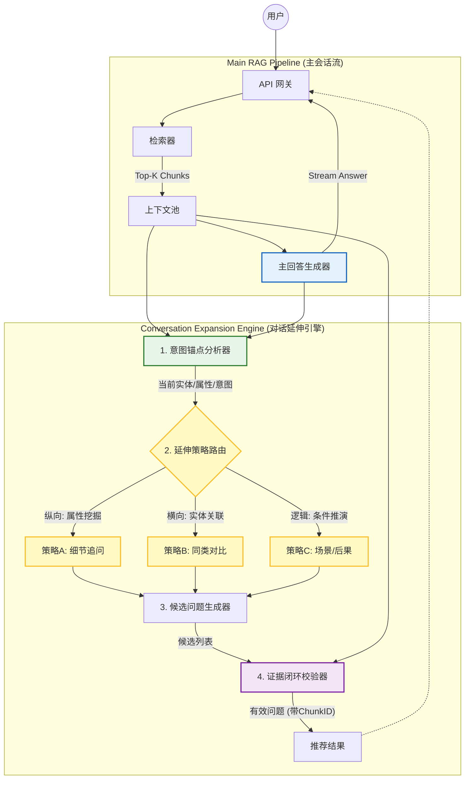

# 基于 RAG 上下文感知的对话延伸架构

## 一、概述

该架构的设计目标是解决**"多轮对话冷启动"**的问题。它不仅仅是挖掘文档剩余信息，而是模拟人类对话的逻辑（追问细节、横向对比、因果推演），在当前文档范围内生成具有**逻辑延续性**的推荐问题。

### 核心特性

- **上下文感知**: 基于当前对话和检索到的文档生成推荐
- **多维度延伸**: 支持纵向深挖、横向拓展、逻辑推演三种策略
- **证据闭环**: 确保推荐的问题 100% 可以从文档中得到回答
- **异步处理**: 主响应同步，推荐异步，不影响用户体验

## 二、宏观架构全景图



## 三、核心组件详细设计

架构分为四个核心处理阶段，确保生成的问题既符合对话逻辑，又严谨地基于文档。

### 1. 意图锚点分析器 (Intent Anchor Analyzer)

**职责**：理解"我们现在聊到了哪里"。

**文件位置**: `src/lib/conversation-expansion.ts` - `IntentAnchorAnalyzer` 类

**核心动作**:
- **实体提取 (Entity Extraction)**: 识别用户当前关注的核心对象（如"Mate 60"）
- **属性定位 (Attribute Focusing)**: 识别用户当前关注的维度（如"价格"）
- **文档范围界定 (Scope Bounding)**: 确定哪些文档片段被主回答使用了，哪些还没用

**输出结构**:

```typescript
interface IntentAnchor {
  entities: ExtractedEntity[];  // 核心实体列表
  attributes: string[];          // 关注的属性/维度
  intentType: string;            // 意图类型
  stage: string;                 // 对话阶段
}
```

### 2. 延伸策略路由器 (Expansion Strategy Router)

**职责**：决定下一轮对话可能的方向。

**文件位置**: `src/lib/conversation-expansion.ts` - `ExpansionStrategyRouter` 类

**三维延伸策略**:

| 策略 | 名称 | 逻辑 | 示例 |
|------|------|------|------|
| **策略A** | 纵向深挖 (Drill-down) | 同一实体的其他属性 | 用户问了"价格"，推荐"它的配置参数是怎样的？" |
| **策略B** | 横向拓展 (Lateral Move) | 同一属性的其他实体 | 用户问了"Mate 60 的屏幕"，推荐"Mate 60 Pro 的屏幕有什么不同？" |
| **策略C** | 逻辑推演 (Logical Flow) | 基于现状的条件、后果或建议 | 用户问了"今日有雨"，推荐"这种天气对晚高峰交通有影响吗？" |

### 3. 候选问题生成器 (Candidate Generator)

**职责**：将策略转化为自然语言问题。

**文件位置**: `src/lib/conversation-expansion.ts` - `CandidateQuestionGenerator` 类

**约束**:
- 使用 **"逆向完形填空"** 技术：先把文档里的答案盖住，让模型反推"什么问题能得到这个答案？"
- 必须保持与用户当前提问相似的语言风格（口语化）

**输出结构**:

```typescript
interface CandidateQuestion {
  question: string;              // 问题内容
  strategy: ExpansionStrategy;   // 采用的策略
  strategyLabel: string;         // 策略标签（显示用）
  sourceChunkIds: string[];      // 关联的文档片段ID
  relevanceScore: number;        // 相关度分数
  validated: boolean;            // 是否通过校验
}
```

### 4. 证据闭环校验器 (Evidence Grounding Validator)

**职责**：确保生成的推荐问题 **100% 可回答**。

**文件位置**: `src/lib/conversation-expansion.ts` - `EvidenceValidator` 类

**校验机制**:
- **双向验证**: 生成的推荐问题必须能与 Context Pool 中的某个 Chunk 产生高向量相似度匹配
- **幻觉拦截**: 如果生成的问题在 Context 中找不到对应的关键词或实体，直接丢弃
- **去重**: 如果生成的问题语义与 User Query 高度重合，丢弃

## 四、数据流转逻辑

假设场景：RAG 知识库是 **"公司员工手册"**。

1. **用户提问**: "请假流程是怎么样的？"

2. **RAG 主流程**: 检索到《考勤管理制度》第3章，生成回答："需要在 OA 系统提交申请，由部门主管审批..."

3. **延伸引擎启动**:
   - **锚点分析**: 当前实体=`请假`，当前属性=`流程`
   - **策略路由执行**:
     - *(纵向深挖)*: 扫描文档，发现还有"病假"、"事假"、"年假"的具体规定 → 生成：**"病假需要提供医院证明吗？"**
     - *(逻辑推演)*: 扫描文档，发现有"审批时长"的描述 → 生成：**"审批通常需要多长时间？"**
     - *(逻辑推演)*: 扫描文档，发现有"未获批"的后果 → 生成：**"如果主管没批，算旷工吗？"**
   - **闭环校验**:
     - 检查发现文档里确实有"病假证明"条款 → **保留**
     - 检查发现文档里确实有"审批时效"条款 → **保留**
     - 检查发现模型编造了一个"请假扣多少钱"（文档里其实没写薪资计算，只写了考勤） → **丢弃/拦截**

4. **前端展示**: 用户看到回答下方出现这三个推荐问题

## 五、API 接口

### POST `/api/conversation-expansion`

**请求体**:

```json
{
  "action": "expand",
  "userQuery": "请假流程是怎么样的？",
  "aiResponse": "需要在 OA 系统提交申请，由部门主管审批...",
  "contextChunks": [
    {
      "id": "chunk-1",
      "content": "请假流程：1. 登录 OA 系统...",
      "score": 0.92
    }
  ],
  "llmModel": "qwen2.5:0.5b",
  "maxSuggestions": 5,
  "enableValidation": true
}
```

**响应体**:

```json
{
  "success": true,
  "suggestions": [
    {
      "question": "病假需要提供医院证明吗？",
      "strategy": "drill-down",
      "strategyLabel": "深入了解",
      "relevanceScore": 0.85,
      "validated": true
    }
  ],
  "anchor": {
    "entities": [{"name": "请假", "type": "action", "confidence": 0.9}],
    "attributes": ["流程"],
    "intentType": "how-to",
    "stage": "exploring"
  },
  "processingTime": 1234,
  "timings": {
    "anchorAnalysis": 300,
    "strategyRouting": 500,
    "questionGeneration": 400,
    "validation": 34
  }
}
```

## 六、前端组件

### SuggestedQuestions 组件

**文件位置**: `src/components/SuggestedQuestions.tsx`

**功能特性**:
- 显示推荐问题列表，按策略类型分类显示
- 支持点击问题自动填充到输入框
- 可展开查看意图分析详情和处理耗时
- 加载状态和空状态处理

**使用示例**:

```tsx
<SuggestedQuestions
  suggestions={suggestedQuestions}
  anchor={suggestionAnchor}
  timings={suggestionTimings}
  isLoading={isSuggestionsLoading}
  onQuestionClick={(question) => setInput(question)}
  showDetails={true}
/>
```

## 七、配置选项

```typescript
interface ExpansionConfig {
  llmModel: string;          // LLM 模型名称
  embeddingModel: string;    // Embedding 模型名称
  maxSuggestions: number;    // 最大推荐问题数量 (默认: 5)
  minRelevanceScore: number; // 最小相关度分数 (默认: 0.3)
  enableValidation: boolean; // 是否启用证据校验 (默认: true)
}
```

## 八、架构优势

该架构建立了**多轮对话的三个基石**:

1. **相关性 (Relevance)**: 通过 **"锚点分析"**，保证推荐问题是紧扣用户当前话题的

2. **丰富性 (Diversity)**: 通过 **"三维策略路由"**，强制系统分别从细节、对比、后果三个方向发散，避免了推荐出的问题千篇一律

3. **可靠性 (Reliability)**: 通过 **"闭环校验"**，保证了每一个"猜你想问"点击后都能得到基于文档的准确回答，不会出现"不知道"的尴尬情况

## 九、文件结构

```
src/
├── lib/
│   └── conversation-expansion.ts    # 核心引擎实现
├── app/
│   └── api/
│       └── conversation-expansion/
│           └── route.ts             # API 路由
└── components/
    └── SuggestedQuestions.tsx       # 前端组件
```

## 十、使用指南

### 在首页启用推荐问题

1. 点击输入框旁边的 💬 按钮启用/禁用推荐问题功能
2. 发送问题后，系统会异步生成推荐问题
3. 推荐问题显示在消息列表下方
4. 点击推荐问题可自动填充到输入框

### 查看推荐详情

推荐问题组件支持展开查看详细信息:
- 提取的实体和属性
- 意图类型和对话阶段
- 各处理阶段的耗时统计

### 策略类型说明

| 图标 | 策略 | 说明 |
|------|------|------|
| 🔍 | 深入细节 | 了解当前话题的更多属性 |
| ↔️ | 横向对比 | 与相关实体进行比较 |
| 💡 | 逻辑延伸 | 探索条件、后果或建议 |
