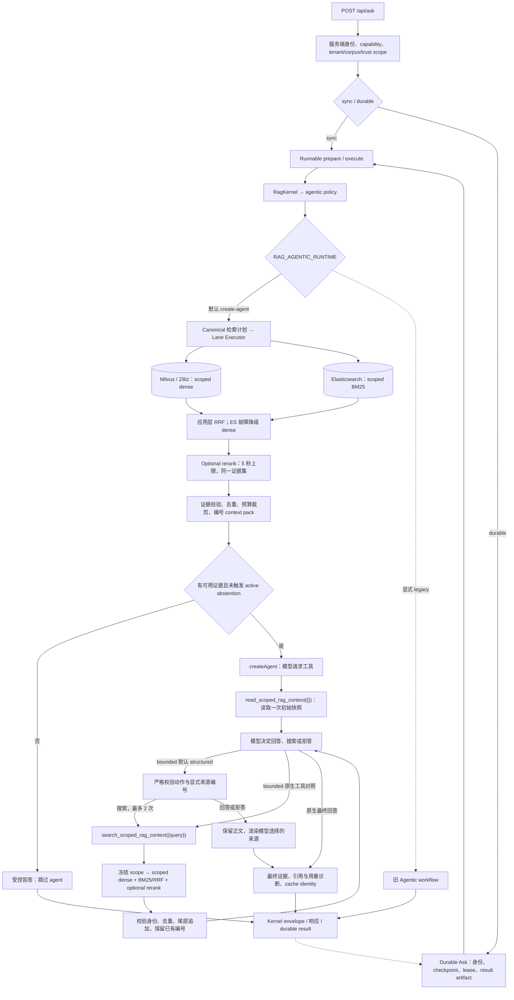

# 当前 Agentic RAG 架构与实践对照

**最后更新 / 源码与官方资料核实日：2026-09-14**

**主入口：** `POST /api/ask`  
**范围：** 当前工作区的 canonical Agentic RAG；部署配置与真实模型效果需要独立验收。

本系统采用 **服务端限定检索 + 受限 `createAgent` 回答**。Kernel 先完成检索、可选重排和证据打包。默认 `snapshot` 模式让 agent 读取一次冻结快照后回答；服务端启用 `bounded` 后，agent 可在读取初始证据后针对缺失事实最多补搜两次。数据库、tenant/corpus/trust、provider 与预算始终由服务端决定。

本轮接通 canonical rerank、有限补搜、追加式证据快照、显式决策与来源选择、最终缓存身份和真实 Agent 评测入口。实现完成不代表目标模型或生产质量已通过；当前默认仍是 `snapshot`，切换依据见[验收与复现](#验收与复现)。执行进度见[本轮计划](../plans/2026-09-07-agentic-rag-execution.md)，完整部署及回滚见[LangChain / LangGraph 指南](../../LANGCHAIN_LANGGRAPH_GUIDE.md)。

## 实际调用链



初始 dense required 是默认计划；`RAG_ELASTICSEARCH_MODE=shadow|active` 时，该主 lane 内并行执行 scoped BM25，active 结果由应用层 RRF 融合。Milvus 原生 BM25 会在 ES 启用时让位，避免词法信号重复计权。ordered context、PDF visual 仍由服务端开关和 capability 决定。补搜复用同一 scoped 双检索与可选 rerank，工具参数不能开启其他 lane。LangGraph 是 `createAgent` 的内部 runtime；Kernel、检索计划和 durable 生命周期仍由仓库实现承担，没有接入自定义 `StateGraph`、LangGraph checkpointer 或 HITL。

| 责任 | 源码入口 | 当前行为 |
| --- | --- | --- |
| 身份与 scope | [request-context.ts](../../src/lib/security/request-context.ts)、[retrieval-scope.ts](../../src/lib/security/retrieval-scope.ts) | 服务端构建 tenant/corpus/trust，拒绝越界及隔离模式下的不受限策略 |
| 请求与接线 | [ask/route.ts](../../src/app/api/ask/route.ts) | 选择 policy/runtime/mode；初始检索、补搜、最终证据与缓存、安全响应投影 |
| 编排与结果 | [workflow.ts](../../src/lib/rag/core/workflow.ts)、[kernel.ts](../../src/lib/rag/core/kernel.ts) | Runnable 调用 Kernel，统一 trace/thread、失败与 envelope |
| 初始检索与证据 | [retrieval-plan.ts](../../src/lib/rag/retrieval/retrieval-plan.ts)、[lane-executor.ts](../../src/lib/rag/retrieval/lane-executor.ts)、[context-composer.ts](../../src/lib/rag/core/context-composer.ts) | required/optional lane、预算、scope 校验、去重、裁剪和编号 |
| 双检索与词法投影 | [milvus-elasticsearch-fusion.ts](../../src/lib/rag/retrieval/milvus-elasticsearch-fusion.ts)、[lexical-index.ts](../../src/lib/elasticsearch/lexical-index.ts)、[postgres-outbox-store.ts](../../src/lib/elasticsearch/postgres-outbox-store.ts) | Milvus dense + ES BM25 并行；应用层 RRF；PostgreSQL outbox 可靠投影，ES 不存向量 |
| 可选重排 | [rerank-lane-handler.ts](../../src/lib/rag/retrieval/rerank-lane-handler.ts)、[rerank-providers.ts](../../src/lib/rag/retrieval/rerank-providers.ts) | 校验候选后调用配置的 provider；只接受同一证据集的完整排列，贯通取消 |
| 有界补搜 | [scoped-followup-retrieval.ts](../../src/lib/rag/retrieval/scoped-followup-retrieval.ts) | 冻结请求 scope，最多 2 次新 query 检索，每次使用独立 embedding，复用 lane 校验和准入 |
| Agent 与证据累计 | [scoped-retrieval-agent.ts](../../src/lib/rag/agents/scoped-retrieval-agent.ts)、[append-scoped-evidence.ts](../../src/lib/rag/agents/append-scoped-evidence.ts) | 先读快照、按模式注册补搜工具；追加证据、固定编号、停止原因与真实轨迹 |
| 结构化决策 | [scoped-agent-decision.ts](../../src/lib/rag/agents/scoped-agent-decision.ts) | 严格动作与来源选择合同、Ollama schema、当前快照来源编号校验；复用既有模型/工具预算 |
| 诊断 | [agent-output-diagnostics.ts](../../src/lib/rag/agents/agent-output-diagnostics.ts) | provider 用量汇总与最终证据引用编号检查 |
| 持久化与身份 | [durable-ask-workflow.ts](../../src/lib/rag/core/durable-ask-workflow.ts)、[cache-identity.ts](../../src/lib/rag/core/cache-identity.ts) | idempotency/checkpoint/lease/replay；结果身份绑定 scope、文档/证据版本、模式、模型与提示词 |
| 评测 | [scoped-agent-target.ts](../../src/lib/rag/eval/scoped-agent-target.ts)、[run-scoped-agent-eval.mjs](../../scripts/run-scoped-agent-eval.mjs) | 调用真实 agent 入口，注入检索/模型，输出任务结果、轨迹、成本与门禁 |
| 外部观测 | [tracing.ts](../../src/lib/langsmith/tracing.ts)、[private-tracing.ts](../../src/lib/langsmith/private-tracing.ts) | 可选 content-free 手工 root；含正文的自动 child spans 绑定非联网 discard client |

## 当前执行边界

| 边界 | snapshot（默认） | bounded（服务端显式启用） |
| --- | --- | --- |
| 环境配置 | `RAG_AGENTIC_RETRIEVAL_MODE=snapshot`；空值同默认 | `RAG_AGENTIC_RETRIEVAL_MODE=bounded`；未知值拒绝 |
| 工具 | `read_scoped_rag_context({})`，严格空 schema | 同一读取工具，加 `search_scoped_rag_context({query})`，query 长度 1–1024 |
| 顺序 | 读取一次后回答 | 必须先读取一次；每轮模型最多请求一个工具，随后可补搜或回答 |
| 调用上限 | 1 次工具、2 次模型、graph recursion 16 | 3 次工具、4 次模型、graph recursion 32；真正启动补搜最多 2 次 |
| 快照 | 第一次模型 await 前校验、复制、冻结 | 同左；新证据只在尾部追加，原编号、正文、版本和 span 保持不变 |
| 上下文预算 | canonical context 最多 4000 估算 token | 累计最多 4000 估算 token，证据上限 `min(40, 3 × topK)` |
| 提示词身份 | `scoped-rag-answer-v3` | 默认 `scoped-rag-structured-answer-v5`；原生对照 `scoped-rag-iterative-answer-v2` |
| 决策模式 | 原生空参数读取后回答 | `RAG_AGENTIC_DECISION_MODE=structured`（默认）或 `native-tools` |

两个模式均禁止模型提供 tenant、corpus、trust、filter、数据库连接、provider 或 URL。scope 及初始快照在模型运行前冻结；补搜结果在追加前再次校验。相同身份、相同来源内容去重；相同 ID 对应不同正文、文档版本、来源或 span 时显式失败，不能改写模型已经看过的证据。工具输出作为不可信数据提供给模型，提示词要求忽略其中的指令；这不是语义安全性证明。

| 共用约束 | 当前合同 |
| --- | --- |
| 时间预算 | 初始 canonical 检索 30 秒；整个 canonical 生成阶段 90 秒，包含 bounded 的模型与补搜；每次补搜（含可选重排）最多 5 秒。显式 legacy workflow 45 秒，见 [request-budgets.ts](../../src/lib/rag/core/request-budgets.ts) |
| Rerank | `enableReranking` 未关闭且路由不是 ordered-context 时增加 optional lane，最多 5 秒；保留 ordered-context 的文档顺序 |
| Rerank 降级 | provider 未配置时跳过；普通 provider 错误、无效响应、超时保留原候选排序；scope 越界与请求取消不降级 |
| 补搜停止 | 重复 query / 无新增证据为 `no_gain`；次数、容量或补搜超时为 `budget`；普通 provider 不可用为 `capability_unavailable`。停止后使用已有证据回答或拒答，不继续启动检索 |
| 取消与后台残留 | 传播 AbortSignal；非协作 provider 超时/取消后，同进程按 retriever 或模型阻止重入，直至残留工作结束 |
| 不足证据 | 初始无 context 直接受控拒答；abstention 默认 `shadow` 只观察，`active` 对初检和补检均按同一阈值筛选；预算裁剪后按实际交付文档覆盖重新判定，遗漏证据显式记录 |
| 合同失败 | 跳过必需读取、未知工具、额外参数、同轮多个工具、重复读取、空回答、scope/integrity 不一致均显式失败 |
| 回滚 | 关闭补搜用 `RAG_AGENTIC_RETRIEVAL_MODE=snapshot`；旧 workflow 回滚才使用 `RAG_AGENTIC_RUNTIME=legacy` |

重排是否真正执行以 `retrievalDetails.rerank.applied`、`provider`、`reason` 及 lane executions 为准；不能仅看请求的 `enableReranking=true`。ES 状态看 `retrievalDetails.elasticsearch.diagnostics`；`degraded` 表示该次查询保留了 Milvus dense 结果。未配置时 ES、hybrid、ordered context、Contextual Retrieval v2 和 PDF visual 不主动启用。旧 hybrid/contextual boolean 仅将对应功能置为 `shadow`；目标环境的开关、capability 和索引准备状态仍需回读。

## 显式补搜决策

bounded 默认在首次原生读取后使用 `answer/search/abstain` JSON 决策。每次沿用既有模型调用，模型决定短 query 或最终正文，并通过 `evidenceNumbers` 明确选择支持该答案的来源。Ollama 通过 `format` 的三分支 `oneOf` JSON schema 约束：动作使用 const 判别，搜索的 answer/来源数组固定为空，回答至少选择一个来源；其他模型通过提示词及严格本地解析使用相同合同。读后决策调用不同时启用原生工具 schema；校验后的 search 被转换为已注册搜索工具调用，继续经过相同 scope、截止时间与 2 search / 3 tool / 4 model 上限。

缺少必要事实但出现文档线索时应补搜；跨文档结论要求引用关系依据和最终事实。未知字段、重复键、非法动作、混合原生工具调用和停止后继续搜索均失败，不把错误 JSON 显示为答案。四字段合同为 `{action, query, answer, evidenceNumbers}`。来源编号最多 40 个、必须是唯一正安全整数且属于当前已交付 context；answer 至少选择一个来源，search 的来源数组必须为空，abstain 可以为空。服务端保留模型正文并渲染其声明的数字引用，不自动选择全部 evidence，也不推断来源的语义支持度。`answerDisposition` 记录模型明确的 answer/abstain 选择，只是模型决策，不代表事实或语义验证通过。`native-tools` 可保留原生对照，snapshot 默认保持不变。

该实现依据 [Ollama structured outputs](https://docs.ollama.com/capabilities/structured-outputs) 的 JSON schema 能力和 [LangChain middleware](https://docs.langchain.com/oss/javascript/langchain/middleware/custom) 的模型调用包装能力；选择将两种输出协议分开是本项目实测后的工程判断。

## 最终证据、缓存与 durable

bounded 成功后，响应 context、served evidence IDs、引用诊断和缓存使用 **最后一次真正交付模型的 context pack**。补搜不会重新给初始证据编号。lane executions 记录实际补搜与重排；workflow 保留真实模型/工具阶段，不伪造 legacy grading、自省或幻觉检查。

context/answer cache identity 在生成后构建，纳入最终证据身份与 span、context hash、检索模式/预算和实际 rerank 状态；answer identity 另绑定对应 promptVersion。durable 路由身份绑定模式和提示词，结果投影按 allowlist 保留 agent 的 `retrievalMode`、`searchCallCount`、`searchStopReason` 、`decisionMode`、受限 `answerDisposition` 及诊断。runtime 继续为 `langchain-create-agent-v1`。身份接线不等于已验证生产缓存命中或跨版本部署 replay。

## 新增诊断合同

成功执行的 scoped agent 在 `agent.diagnostics` 返回诊断，并同步投影至 `retrievalDetails.generation.diagnostics`；durable 首次结果与 replay 使用同一受限合同。诊断不包含 prompt、工具正文或内部 messages，也不额外调用 LLM。

| 字段 | 含义与限制 |
| --- | --- |
| `version` | `scoped-agent-diagnostics-v1` |
| `modelResponseCount` | 成功返回的 AI message 数；不是 provider 请求尝试数，不计 adapter/provider 内部重试 |
| `usage.measurement` | `provider`：返回模型消息均具备完整用量；`partial`：仅有部分用量；`unavailable`：无可用 provider 用量 |
| `usage.measuredModelResponses` | 提供可用 token 用量的模型响应数 |
| `usage.inputTokenCount` / `outputTokenCount` | 仅累计对应已知 provider 数据；未知不补零或估计，partial 不代表完整 run 成本 |
| `citations.validation` | 固定 `reference-only`，只检查引用编号是否对应最终已交付证据 |
| `citations.status` | `valid` / `missing` / `invalid`：可识别引用有效、缺少可识别引用、存在无效引用 |
| `citations.citationCount` / `invalidCitationCount` | 可识别数字引用的出现次数及其中无效次数；组合引用按每个数字计数 |
| `citations.citedEvidenceIds` | 有效引用对应的去重证据 ID，绑定最后交付快照的编号顺序 |

检查识别正文中的 `[1]`、`[1, 2]`、`[1，2]` 等数字引用，排除常见代码和链接形式；它不是完整 Markdown/文献引用解析器，不能把任意引用格式都纳入统计。

编号对应的是裁剪后真正交给模型的证据，不能用原始搜索结果下标重新映射。编号存在不等于句子受证据支持；本地检查没有验证蕴含关系、完整性或事实正确性。原有正文引用诊断仅观察，missing/invalid 不自动改写答案或改变拒答决策；结构化模式另对模型声明的来源编号执行严格合同校验，合法编号的渲染也不代表语义支持验证。未执行 agent 的受控拒答不伪造模型用量。

## 官方实践对照

以下以核实日可访问的官方资料为依据；下一步验收是结合当前代码作出的工程判断。

| 官方实践与来源 | 当前落点 | 下一步验收 |
| --- | --- | --- |
| 从简单、可组合流程开始，再按收益增加自主性。[Anthropic：Building effective agents](https://www.anthropic.com/engineering/building-effective-agents) | 保留 snapshot 基线，bounded 由服务端启用 | 同一语料、模型和预算比较收益后再切默认流量 |
| 根据检索结果选择回答或改写查询。[LangGraph：Agentic RAG](https://docs.langchain.com/oss/javascript/langgraph/agentic-rag) | bounded 可在首次读取后生成 query 补搜，受次数、时间、scope 与证据预算约束 | 目标 provider 原生工具合同与多跳失败案例；不把框架支持等同模型质量通过 |
| 筛选组织任务上下文并控制工具输出。[Anthropic：Effective context engineering](https://www.anthropic.com/engineering/effective-context-engineering-for-ai-agents) | 去重、token 预算、不可变前缀和追加证据 | 评估裁剪后证据保留率；tokenEstimate 不当作实际 provider 用量 |
| 引用关联可追溯来源节点。[LlamaIndex：Citation query engine workflow](https://developers.llamaindex.ai/python/examples/workflow/citation_query_engine/) | 最终快照编号映射到 evidence ID/span | 独立标注语义支持度，不能把编号 valid 当作 grounding pass |
| 多路召回与候选过滤。[Milvus：Multi-vector search](https://milvus.io/docs/multi-vector-search.md)、[Filtered search](https://milvus.io/docs/filtered-search.md) | scoped dense 基线、受开关约束的 hybrid、canonical optional rerank | 真实索引/provider 消融，验证身份、过滤、收益与延迟 |
| 同时评估结果、轨迹与多次试验。[Anthropic：Demystifying evals for AI agents](https://www.anthropic.com/engineering/demystifying-evals-for-ai-agents) | scoped Agent adapter、V2 fixture、三种 variant、trials、安全/预算/质量门禁 | 固定业务语料，人工校准答案/拒答及语义引用评分，记录延迟和真实用量 |

## 验收与复现

```powershell
# 本轮 Agent / append / rerank / followup / HTTP / eval 合同
pnpm test:rag-agentic

# 原有数据、策略与矩阵合同
pnpm rag:eval:validate
pnpm rag:eval:contracts
pnpm rag:eval:matrix

# 默认离线 fake，依次比较 snapshot / rerank / iterative
pnpm rag:eval:agent

# 指定 variant 并启用严格质量门禁
pnpm rag:eval:agent --variant iterative --trials 3 --gate

# 真实本地 Ollama 模型；检索和 rerank 仍使用同一 fixture
pnpm rag:eval:agent --provider ollama --model llama3.1 --variant snapshot --trials 1 --max-duration-ms 120000
pnpm rag:eval:agent --provider ollama --model llama3.1 --variant iterative --trials 3 --max-duration-ms 600000 --gate

# 固定中英保留集与明确模型配置；结果仍需通过全部门禁
pnpm rag:eval:agent --provider ollama --model qwen3:latest --variant iterative --think on --num-predict 2048 --fixture src/lib/rag/eval/fixtures/scoped-agent-holdout-v1.json --trials 3 --max-duration-ms 1200000 --gate
```

[scoped-agent-v1.json](../../src/lib/rag/eval/fixtures/scoped-agent-v1.json) 是 V2 schema 固定语料，覆盖 11 个可回答、多跳、拒答、冲突、干扰与 scope 案例。CLI 的 `snapshot` 不重排，`rerank` 使用 fixture 重排，`iterative` 在同样重排基础上启用有界补搜；不是三种生产 provider。

新增 [scoped-agent-holdout-v1.json](../../src/lib/rag/eval/fixtures/scoped-agent-holdout-v1.json) 保留集包含 8 个中英文案例，含两次补搜链、自然文档引用、直接回答、缺失事实和注入干扰。该数据集在真实模型评测前固定；gold 不用于运行时规则。用 `--fixture` 选择，`--decision-mode structured|native-tools` 比较决策协议（默认 structured，仅 iterative 生效）。

CLI 默认 `fake`，指定 `--provider ollama` 才连接本机 `127.0.0.1:11434`。可选 `--think on|off` 与 `--num-predict 1..8192` 用于明确比较模型配置；生成上限默认 700，Qwen3 默认关闭 thinking，其余模型沿用 provider 默认。实际构造参数与报告 `modelParameters` 来自同一对象，推理正文不写入报告，provider token 用量仍计入。Ollama 的 thinking 开关能力见[官方说明](https://docs.ollama.com/capabilities/thinking)。未知参数拒绝，`--trials` 为 1–10，`--variant` 可重复指定；`--max-duration-ms` 是整个 CLI 运行总截止时间（默认 120000，最大 3600000）。provider retries 设为 0；执行失败或超时后停止创建新模型/provider，不自动退回 fake。

安全、预算和执行检查始终影响退出码；`--gate` 额外要求 E1b 质量门禁通过。报告默认写入 `.codex-tmp/rag-eval/scoped-agent/`，可用 `--output` 指定；包含每个 variant/trial 的结果与总报告。轨迹记录模型调用/响应、工具、检索/重排、搜索停止原因和预算违规。provider 不完整用量单列 partial 字段，不纳入完整成本指标；结构化模式使用显式 abstain 动作识别非空上下文拒答；原生模式仍使用明确文本规则，两者都不能代替人工校准。

所有内置 variant 都使用确定性 scoped lexical fixture 检索和 fixture rerank，`productionQualityMeasured=false`。真实模型有响应才标记 `realModelMeasured=true`；它只证明真实模型被测，不能证明真实 embedding、Milvus、商业 reranker、业务答案或生产部署质量。gold 只参与评分，不提供给检索 query 或模型。

### 验证记录

2026-09-07 的前一轮诊断更新曾通过 Agent + canonical ask + Kernel 101 条、durable/route/cache 22 条、production-policy contract 23 条，以及两个 target 各 8 条的确定性 E1b matrix。这些属于**本轮补搜/重排实现之前的历史结果**，不能作为当前代码总验收；当时 Neo4j 依赖与 ESLint shim 阻塞也不能推断为当前环境仍然阻塞。

**首次有界检索实施的历史验证：** Agentic 专项 194/194、RAG 内核 659/659、评测基础设施 68/68、生产策略合同 23/23、真实 Milvus canary 3/3；TypeScript、变更范围 ESLint、Next 生产构建及 standalone 检查通过，独立审查无未解决发现。确定性 iterative 的 11 案例严格门禁通过。真实 Qwen 的 snapshot/rerank/iterative 各 11 案例及最终 iterative 三次重复均完成，但事实覆盖率仍为 0.8333、多跳未主动补搜，严格质量门禁未通过，所以默认继续 snapshot。引用有效性只是编号/来源身份检查；上述结果不等于语义支持或生产质量证明。完整命令、原始日志、全仓历史 lint 问题及构建钩子的 Notion 同步观察见[执行计划](../plans/2026-09-07-agentic-rag-execution.md)。

**继续执行的最终 v5 验证：** Agentic 专项串行 282/282、真实 Milvus 合成 canary 3/3、类型/定向 ESLint/生产构建通过，独立代码与安全审查无遗留发现。真实 Qwen 原始 11 例三轮全部完成，事实覆盖从原生对照的 0.8333 提升为 1，来源覆盖仍为 0.9167；固定中英 8 例三轮全部完成，实际两次补搜链可运行，但事实覆盖 0.7143、来源覆盖 0.8571，缺失事实拒答也未通过。启用 thinking 的单轮对照没有改善整体指标。严格 E1b 质量门禁仍未放行，保持 snapshot 默认；完整失败记录、冷加载延迟和数据集身份见[最终执行记录](../plans/2026-09-07-agentic-rag-execution.md#继续执行结构化决策与来源协议-v52026-09-07)。

生产 rollout 需依次通过：固定 fixture 合同 → 目标模型重复试验 → 真实 scoped 索引/canonical ask canary → 业务语料质量与拒答校准 → durable/取消/重放及部署配置回读。只有在 snapshot/rerank/iterative 的同条件消融显示可接受的质量、延迟和成本后，才启用目标流量的 bounded 模式。生产 canary 和 LangSmith Cloud 步骤见[完整指南第 9 章](../../LANGCHAIN_LANGGRAPH_GUIDE.md)。

## 相关文档

- [本轮实施与验收计划](../plans/2026-09-07-agentic-rag-execution.md)
- [完整架构、搭建与回滚指南](../../LANGCHAIN_LANGGRAPH_GUIDE.md)
- [环境配置](../../ENV_CONFIG_GUIDE.md)
- [PostgreSQL 部署](../deployment/postgresql.md)
- [容器部署](../deployment/container.md)
