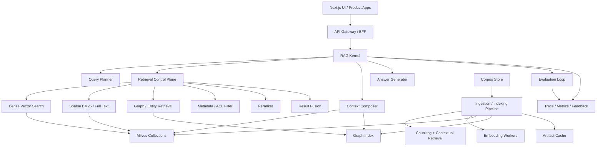

# RAG System Architecture Evolution

## Phase 1: Think

### 需求分析

用户要求分析当前项目架构,判断它作为 RAG 系统继续发展时有哪些优化空间,并给出当前最新和更优的目标架构。

本次是架构分析 sprint,不做业务代码修改。重点范围:

- 当前 Next.js 单体项目内的 RAG / Milvus / Agentic / MiroFish / OpenMAIC 边界。
- 面向生产 RAG 的索引、检索、生成、评估、缓存、可观测性闭环。
- 在不推翻现有功能的前提下,给出可演进的目标架构。

### 外部参考基线

- OpenAI Retrieval API 文档强调 vector store 是语义检索容器,文件加入后会被 chunk、embed、index,这说明生产 RAG 需要显式的索引生命周期和异步文件状态。
- LangChain Retrieval 文档把 loaders、splitters、embeddings、vector stores 作为可替换模块,并区分 2-step RAG、Agentic RAG、Hybrid RAG。
- Anthropic Contextual Retrieval 强调在 embedding 和 BM25 前给 chunk 加全文上下文,并建议与 BM25、rerank 叠加。
- Milvus 文档强调多向量/稀疏-稠密 hybrid search,适合同时处理语义匹配和关键词精确匹配。
- Ragas 文档强调用组件级指标评估 RAG 和 Agentic workflows,而不是只看最终答案。
- GraphRAG 论文指出普通 RAG 对全局语料问题较弱,需要图谱索引和社区摘要来处理 global sensemaking。
- RoutIR 2026 论文把 query expansion、first-stage retrieval、fusion、reranking 抽象成可配置在线 retrieval pipeline,这是当前项目下一步最值得吸收的架构方向。

## Phase 2: Plan

1. 梳理当前真实架构。
2. 评估架构优点和短板。
3. 给出目标架构。
4. 给出分阶段迁移路线。

## Phase 3: Work

## 当前真实架构

### 1. 应用边界

当前项目是 Next.js 单体应用。UI 页面、API routes、RAG pipeline、Milvus client、agent workflows、MAIC/OpenMAIC、MiroFish 都在同一个进程和仓库内。

核心入口:

- `src/app/api/ask/route.ts`: 主问答入口,按 `storageBackend`, `useAgenticRAG`, `useAdaptiveEntityRAG` 分支到不同实现。
- `src/app/api/pipeline/route.ts`: 文档处理入口,负责文本/文件/URL/YouTube 等导入到 Milvus。
- `src/lib/rag-system.ts`: 内存版 LocalRAGSystem,自带 tokenizer、内存向量存储、prompt 和 observability。
- `src/lib/document-pipeline.ts`: 文档加载、切分、Contextual Retrieval、embedding、写入 Milvus。
- `src/lib/milvus-client.ts`: Milvus 连接、collection schema、索引、插入、搜索。
- `src/lib/agentic-rag.ts`: LangGraph 风格的 agentic retrieval workflow。
- `src/lib/adaptive-entity-rag.ts`: 实体解析、策略控制、混合检索、rerank。
- `src/lib/self-corrective-rag.ts`: retrieve -> grade -> rewrite -> generate 的质量闭环。
- `src/lib/maic/rag-bridge.ts`: OpenMAIC 课程材料镜像进共享 RAG uploads corpus。
- `src/lib/mirofish/*`: 图谱/ontology/profile/simulation/report 等独立应用链路。

### 2. 已有优势

- 能力覆盖很宽: naive RAG、Milvus RAG、Agentic RAG、Self-Corrective RAG、Adaptive Entity RAG、Reasoning RAG、Contextual Retrieval、Semantic Cache 都已经有实现或文档。
- 模型层已有抽象: `model-config.ts` 与 `embedding-config.ts` 已把 LLM、Embedding、Reasoning provider 分开,这是继续演进的好基础。
- 存储层已有 Milvus: 支持 collection schema、索引类型、维度识别、Zilliz Cloud、本地 Milvus。
- 可观测性已有雏形: `observability.ts` 有 trace/span/generation/score 模型。
- MiroFish/OpenMAIC 已经开始共享 RAG 语料和 artifact cache,说明跨产品复用方向是对的。

### 3. 核心短板

#### 短板 A: RAG 模式是横向分支,不是统一内核

`/api/ask` 现在按请求参数直接分支到 memory、milvus、agentic、adaptive entity。每个模式自己创建检索、prompt、rerank、生成、响应结构。这样会导致:

- 新增能力时继续复制分支。
- 评估、缓存、trace、prompt contract 很难统一。
- MiroFish/OpenMAIC 想复用 RAG 能力时只能绕到 uploads 或单独 bridge。

#### 短板 B: 索引生命周期不完整

项目有 `DocumentPipeline`,但还缺少 production RAG 必需的 corpus/index lifecycle:

- 文件或 URL 的版本、hash、来源、权限、失效状态。
- document -> chunk -> embedding -> index record 的稳定 lineage。
- 异步 ingestion job 状态。
- 删除/更新后的 eventual consistency 处理。
- 多 collection / 多 tenant / 多产品 corpus 策略。

#### 短板 C: 检索层没有统一 Retrieval Control Plane

当前已有 dense vector、Contextual Retrieval、entity hybrid、LLM rerank、semantic cache,但这些能力分散在不同模块。缺少统一策略描述:

- query rewrite 是否执行。
- dense / sparse / graph / metadata filter 如何并行。
- 多路结果如何 fusion。
- rerank 使用哪种模型。
- topK、threshold、context budget 如何动态控制。
- cache 是否按 query、artifact、retrieval result 分层命中。

#### 短板 D: GraphRAG 与 MiroFish 图谱没有汇入主 RAG

MiroFish 已有 ontology / graph builder / profile / simulation,而主 RAG 也有 entity-extraction、adaptive-entity-rag。它们现在更像两个平行世界:

- MiroFish 图谱偏社媒仿真和人设。
- 主 RAG entity graph 偏检索路由。
- 没有统一 graph index / entity store / community summary。

这会限制系统回答“全局主题、关系链、跨文档归纳、群体态势”类问题。

#### 短板 E: 评估闭环弱于能力复杂度

已有 observability 和 analysis middleware,但缺少一套固定的 RAG eval harness:

- retrieval recall / context precision / context relevance。
- faithfulness / answer correctness / citation coverage。
- latency / token / cost。
- 分模式 A/B 测试。
- 标准 golden questions。

当前功能越多,越需要用评估控制复杂度。

## 推荐目标架构

目标不是推翻现有 Next.js 单体,而是在单体内先建立清晰的 RAG Core,以后再决定是否拆服务。

### 1. RAG Kernel

新增统一核心模块,建议路径:

- `src/lib/rag/core/types.ts`
- `src/lib/rag/core/kernel.ts`
- `src/lib/rag/core/policies.ts`
- `src/lib/rag/core/context-composer.ts`
- `src/lib/rag/core/evaluator.ts`

职责:

- 接收标准化 `RagQueryRequest`。
- 执行 query planning。
- 调用 retrieval plan。
- 统一 context packing 和 citation。
- 调用 generator。
- 输出标准 `RagAnswerEnvelope`。

所有现有模式都变成 policy:

- `naive-memory` policy
- `milvus-2step` policy
- `agentic` policy
- `self-corrective` policy
- `adaptive-entity` policy
- `reasoning` policy
- `maic-course` policy
- `mirofish-research` policy

### 2. Retrieval Control Plane

新增统一检索编排层,建议路径:

- `src/lib/rag/retrieval/retrieval-plan.ts`
- `src/lib/rag/retrieval/router.ts`
- `src/lib/rag/retrieval/fusion.ts`
- `src/lib/rag/retrieval/reranker.ts`
- `src/lib/rag/retrieval/cache.ts`

推荐标准流程:

1. Query normalization。
2. Query classification: factoid / exploratory / global / entity-constrained / course-grounded。
3. Query rewrite / expansion,可选。
4. Parallel first-stage retrieval:
   - dense vector search
   - sparse BM25 / full text
   - metadata filter
   - graph/entity retrieval
5. Result fusion。
6. Rerank。
7. Context budget packing。
8. Evidence contract 输出。

这样可以吸收 RoutIR 式“用 JSON/配置描述 retrieval pipeline”的思想,但先保持 TypeScript 内部实现。

### 3. Corpus Store + Index Lifecycle

新增统一语料管理层,建议路径:

- `src/lib/rag/corpus/corpus-store.ts`
- `src/lib/rag/corpus/document-store.ts`
- `src/lib/rag/corpus/chunk-store.ts`
- `src/lib/rag/corpus/index-jobs.ts`

核心对象:

- `Corpus`: 一个产品/租户/课程/项目的知识集合。
- `DocumentAsset`: 原始文件或 URL。
- `ParsedDocument`: 解析后的文本和结构。
- `Chunk`: 稳定 chunk id、source hash、metadata、parent document。
- `IndexJob`: ingestion / embedding / graph build / reindex 状态。
- `IndexManifest`: 当前 corpus 的索引版本。

当前 uploads、MAIC course mirror、MiroFish project text 都应进入同一个 Corpus abstraction,而不是靠文件夹约定连接。

### 4. Hybrid Index

Milvus 继续作为主向量库,但目标 schema 应升级为:

- dense vector field。
- sparse/BM25 field 或等价 full text index。
- content 与 source metadata。
- document_id、chunk_id、corpus_id、version_hash。
- ACL / product / course / project filter fields。
- contextual_preamble、original_content。

Milvus 已支持 multi-vector hybrid search,这比当前单 embedding field 更适合生产 RAG。

### 5. GraphRAG Layer

GraphRAG 不应替代普通 RAG,而是作为 retrieval lane:

- entity extraction。
- relation extraction。
- community detection。
- community summaries。
- local graph retrieval。
- global summary retrieval。

MiroFish 的 ontology/profile/graph builder 可以作为 graph layer 的产品化先行模块。主 RAG 则需要抽出通用 `EntityStore` 和 `GraphIndex`,让 MiroFish 和 Adaptive Entity RAG 共享实体规范化与关系数据。

适合 GraphRAG 的 query:

- “整个语料的核心主题是什么?”
- “A 与 B 的关系如何演变?”
- “不同群体对某事件的态度差异?”
- “课程材料里哪些知识点形成依赖链?”

### 6. Evaluation And Observability

把 `observability.ts` 从内存 trace 升级为可持久化 eval/trace 层:

- 每次 query 保存 request、policy、retrieval plan、retrieved chunks、rerank scores、final context、answer、citations、latency、token、cost。
- 引入 golden dataset。
- 引入 RAG 指标:
  - context precision
  - context recall
  - faithfulness
  - answer correctness
  - citation coverage
  - latency p50/p95
  - cache hit rate
- 对不同 policy 做 A/B 评估。

### 7. Cache Strategy

当前刚补的 artifact cache 是正确方向,目标分三层:

- L1 query/result cache: 语义相似 query 命中,适合低风险 FAQ。
- L2 retrieval cache: query plan + first-stage retrieval + rerank result。
- L3 artifact cache: contextual chunks、MAIC prepared course、MiroFish ontology/profile、GraphRAG community summary。

所有缓存 key 必须包含:

- source hash / corpus version。
- policy version。
- prompt version。
- model signature。
- retrieval parameters。

## Phase 4: Review

### 最重要结论

当前项目不是缺 RAG 功能,而是缺一个统一的 RAG 架构内核。继续直接添加新模式会让 `/api/ask` 分支越来越厚,最终难以评估、缓存、复用和迁移。

最佳演进方向:

1. 保留当前 Next.js 单体和现有功能。
2. 先抽 `RAG Kernel + Retrieval Control Plane`。
3. 再统一 Corpus / Index lifecycle。
4. 最后把 MiroFish graph 和 Adaptive Entity RAG 汇入 GraphRAG lane。

### 优先级路线

#### P0: 先统一接口,不动能力

- 定义 `RagQueryRequest`, `RagPolicy`, `RetrievalPlan`, `Evidence`, `RagAnswerEnvelope`。
- `/api/ask` 改为调用 kernel,现有分支迁移成 policy adapter。
- 保证响应字段兼容。

#### P1: 统一索引生命周期

- 建立 `CorpusStore` 和 `IndexManifest`。
- 让 uploads、MAIC mirror、MiroFish project 都注册成 corpus source。
- 建立异步 index job 状态,避免 API route 中同步长任务。

#### P2: 上 hybrid retrieval

- 在 Milvus 中支持 dense + sparse/BM25。
- 引入 first-stage retrieval fusion。
- 把 rerank 从 Adaptive/Agentic 私有逻辑抽到共享 reranker。

#### P3: 上 GraphRAG lane

- 抽通用 EntityStore / GraphIndex。
- 复用 MiroFish ontology 和 entity normalization。
- 增加 community summary artifact cache。

#### P4: 上 evaluation harness

- 建 golden questions。
- 保存 trace 到持久存储。
- 每种 policy 跑 context precision、faithfulness、latency、cache hit。

## Phase 5: Compound

### 架构规则

- 后续不要再给每个 RAG 形态新增独立 `/api/ask` 分支。
- 新 RAG 能力必须先表达为 policy、retrieval lane、evaluator 或 corpus adapter。
- MiroFish/OpenMAIC 的专业能力应沉入共享 RAG kernel,而不是继续作为旁路系统。

### 推荐下一步实施任务

1. 写 `src/lib/rag/core/types.ts` 和 `kernel.ts`,只包住现有行为。
2. 把 `/api/ask` 的 memory/milvus/agentic/adaptive 分支迁移为 policy adapter。
3. 为 kernel 输出加最小 trace envelope。
4. 加 3-5 个 golden question smoke tests。

