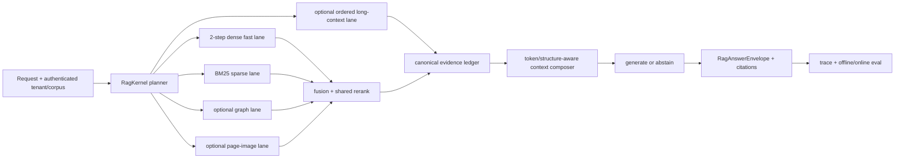

# 2026 RAG 趋势与当前项目下一阶段选择

## MiroFish / OpenMAIC 当日增量快照

截至 2026-07-15 的官方复核结果：

- [MiroFish](https://github.com/666ghj/MiroFish) `main` 仍为
  `96096ea0ff42b1a30cbc41a1560b8c91090f9968`，latest release 仍为
  [`v0.1.2`](https://github.com/666ghj/MiroFish/releases/tag/v0.1.2)。相对
  2026-07-14 本地锚点为 0 commit / 0 file delta，因此不制造源码 churn。
- [OpenMAIC](https://github.com/THU-MAIC/OpenMAIC) `main` 从昨日锚点
  `40ff80ab63a6f3db2bd4e09fd0cbf56a34a45941` 前进 8 个提交至
  [`0db93bde0a6b736bd7a96d2a00fc5279c864e69d`](https://github.com/THU-MAIC/OpenMAIC/commit/0db93bde0a6b736bd7a96d2a00fc5279c864e69d)；
  latest release 仍为 [`v0.3.0`](https://github.com/THU-MAIC/OpenMAIC/releases/tag/v0.3.0)。

OpenMAIC 新增 8 个提交的本地处理：

| 上游增量 | 本地判断 |
|---|---|
| image storage ID / ArrayBuffer 修复 | 本地没有对应的 OpenMAIC image blob storage，跳过 |
| VideoTimeline IR / video export | 本地没有视频导出 runtime，延后到独立媒体导出设计 |
| PBL learner state 迁入 RuntimeStore（2 commits） | 本地保持轻量 `Course -> Prepared -> Scene -> Action`；需持久化/回填设计后再迁移 |
| audio/video extraction + AliDocMind provider | 先进入 shared document adapter 设计，不在 MAIC route 新建私有 provider seam |
| `edit_elements` editor agent | 本地没有上游 Pro editor state model，跳过 |
| issue intake chore | 无运行时影响 |

`v0.3.0` 中与当前 RAG 主链可移植的工程信号是 planner eval、安全 SSRF/本地网络拒绝、
有界并发与统一 action/state seam；本轮把其中适用于 canonical RAG 的安全边界与 E1a 评测
真正落地。PBL v2、per-stage model routing、统一 scene actions 和 reasoning-aware JSON parser
已由 2026-06-26 / 2026-07-14 两轮本地同步覆盖。

## 结论先行

当前项目下一步不应继续堆叠新的“RAG 模式”。项目已经有 dense Milvus、Agentic/Self-Corrective/Reasoning、实体图、Contextual Retrieval、共享 rerank、trace 和 `RagKernel` 骨架；真正限制演进的是这些能力尚未被同一套可执行检索控制面、证据合同、评测与安全边界约束。

推荐顺序：

1. **P0：安全/租户边界 + 可执行 Eval 基线。** 这是上线可信度与后续所有 A/B 决策的前提。
2. **P1：把 RetrievalPlan 从描述性 envelope 变成可执行 control plane。** 先接 dense，再接真正的 corpus-level BM25 + dense + RRF。
3. **P1：统一 evidence/citation、token/结构感知 context 与 abstain。** 先做简单、可解释、可测的规则路由。
4. **P2：MiroFish GraphRAG、ordered long-context、PDF visual sidecar 做条件式试点。** 只在各自题型上过门槛才扩展。
5. **暂缓：RL 训练的 agentic retriever、全量 GraphRAG 替换、Milvus 3.0 beta、LlamaIndex Python 主框架、AI SDK UI/消息协议重写。**

一个会影响近期计划的已验证变化：`src/lib/rag/retrieval/hybrid-policy.ts` 仍写着“Zilliz Serverless 不支持 sparse”，但当前 Zilliz Cloud 官方文档已经支持内置 BM25 full-text 与 sparse+dense hybrid。平台文档层面的能力缺口已经消失；当前部署实例/plan 是否支持仍须 capability probe 与 schema 兼容验证，本项目的回填、adapter、shadow rollout 和评测也尚未完成。

## Phase 1：Think / Research

### 目标

回答三个问题：

1. 当前仓库的 RAG 能力哪些是真实运行路径，哪些只是类型、计划或占位？
2. 2025–2026 的 RAG 发展趋势中，哪些已经具备可生产采用的官方能力，哪些仍主要是研究方向？
3. 在不破坏 MiroFish/MAIC 和现有问答路径的前提下，项目最值得推进、验证或明确暂缓的选择是什么？

### 范围

- 读取当前代码、测试、计划、架构规则和依赖版本。
- 只采用官方文档、官方 release、论文页面/正式会议页面和官方代码仓库作为外部主证据。
- 形成趋势—现状—缺口—价值—风险—可证伪门槛矩阵。
- 给出后续实施波次；用户确认“直接实施”后，在不安装新依赖、不做破坏性 schema 迁移的
  前提下完成 Wave 0 E0 与 E1a。

### 非目标

- 不用公开 benchmark 的数字替代本项目中文私域语料的实测。
- 不因为框架发布新版本就升级依赖。
- 不把 GraphRAG、长上下文、Agentic RAG 或多模态声明为全局默认。
- 不把 LangSmith thread metadata 当成已完成的 eval harness，也不把 Runnable metadata 当成 durable checkpoint。
- 不把 dense 候选集内的 BM25 重排称为全库 sparse+dense hybrid retrieval。

### 成功标准

- 每项建议同时有外部趋势证据和本地代码证据。
- 明确区分已实现、部分实现、声明先于实现和缺失。
- 给出 P0/P1/P2/暂缓，并为每个高风险候选定义退出条件。
- 后续实施能够沿一个 canonical request/evidence/eval 路径推进。

## 已验证事实：当前仓库能力（Wave 0/1 实施前快照）

下表保留 2026-07-15 研究阶段的 pre-Wave 事实，便于追溯决策依据；它不是当前实现状态。
当前状态以文末“Wave 1 实施回写”为准。

| 能力 | 状态 | 本地证据 | 结论 |
|---|---|---|---|
| `RagKernel` 与 `/api/ask` | 部分实现 | `src/app/api/ask/route.ts:229-270` 只注册 memory、milvus-2step、agentic、adaptive-entity；`src/lib/rag/core/kernel.ts:32-50` 在 legacy policy 完整执行后才生成默认 plan | Kernel 目前主要是 policy adapter + execution envelope，不是 lane executor |
| Retrieval plan | 声明先于执行 | `src/lib/rag/retrieval/retrieval-plan.ts:3-11` 声明 memory/dense/sparse/metadata/graph/fusion/rerank/generation-only | lane taxonomy 已有，但尚无统一执行器、预算与 stop reason |
| Dense Milvus | 已实现 | `src/lib/milvus-client.ts` 已包含 schema、index、filter、group、consistency、search params 与 search | 可作为 baseline 与 control lane，不需要重写 |
| Sparse + dense hybrid | 缺失 | `src/lib/rag/retrieval/hybrid-policy.ts:1-38` 始终 throw；`src/lib/reasoning-rag.ts` 的 BM25 只处理 dense 返回候选 | 需要独立全库 sparse candidate pool、fusion 与 shadow collection |
| 共享 rerank | 部分实现 | `src/lib/rag/retrieval/rerank-providers.ts` 有 SiliconFlow/Cohere/Voyage；`rerankDocuments` 没有 production call site；Reasoning/Adaptive 另有各自 LLM rerank | 项目不是完全没有 rerank，缺的是共享 provider/runtime seam |
| Evidence / citation | 基本未接入 | `src/lib/rag/core/types.ts:77-94` 有类型；`src/lib/rag/core/context-composer.ts:8-34` 无 production call site；`/api/ask` 返回各自 `retrievalDetails` | 先统一 canonical evidence，再谈引用正确性和跨 policy eval |
| Context packing | 部分实现 | `context-composer.ts:12-31` 用字符数 first-fit 截断；PDF parser 能保留 `pageTexts`，下游仍主要聚合成文本 | 缺 token budget、页/节顺序、span、表格/图像 sidecar |
| Eval | 基本缺失 | `src/lib/rag/eval/golden-questions.ts:11-36` 仅 4 条 smoke；无 runner/metrics/experiment/CI gate | 当前无法证明任何新增模式优于 dense baseline |
| Observability | 部分实现 | `/api/ask` 有 LangSmith root run；memory path 有更完整 local/Supabase trace；kernel envelope 主要进入 header | 需要同一事件合同覆盖所有 policy、lane、evidence、cost 与 cache |
| Security / tenant | 运行时缺失 | `/api/ask` 信任 body 的 `userId`；`/api/pipeline` 可抓 URL；Milvus schema 无强制 tenant/corpus scalar filter | 公开部署前属于 P0；还存在 SSRF、间接 prompt injection 与跨租户检索风险 |
| Corpus / provenance | 脚手架 | `src/lib/rag/corpus/corpus-store.ts:13-28` 有 `sourceHash`/manifest，但为内存 store，未成为所有摄取/检索路径的强合同 | 可以演进为 provenance、版本、ACL 与 cache invalidation 基础 |
| Agentic / explicit state / durable | agentic 已有，显式状态不统一，durable 缺失 | 当前工作流基于 `RunnableLambda`/`RunnableSequence`；没有统一 transition/budget/stop contract，也没有 checkpointer、interrupt、resume | 复杂 RAG 编排仍需显式可观察状态；只有跨重启、延迟审批或 HITL 才引入 durable checkpoint runtime |
| Multimodal | 文本/OCR 型 | 支持 PDF/Office/Excel/URL/字幕；LiteParse OCR 可选；无 image/table/layout embedding | 先保留 page/section/span，再按图表题集决定 visual lane |
| Cache | 局部实现 | embedding/artifact cache 已有 version/model/source identity；answer semantic 与 contextual cache 作用域不足，且 Agentic 实例每请求重建使生命周期失效 | 优先补 answer/context cache 的 tenant/corpus/index/policy/model/prompt scope 与生命周期，不要求纯 embedding cache携带无关 policy identity |

### 额外正确性缺口

- `src/lib/rag/core/workflow.ts:94-98` 会把 `RagKernelExecutionError` 包成普通 `Error`，而 route 只识别原类型附加失败 header；失败 envelope 存在类型保真断链。
- Milvus/Agentic/Adaptive handler 会自行捕获异常并返回 HTTP 500 `NextResponse`；Promise 对 kernel 仍是正常 resolve，因此非 2xx policy response 仍可能被标为 `completed`（`route.ts:431-440,531-540,657-665`）。
- `src/app/api/ask/route.ts:103-143` 对 `topK`、`maxRetries`、模型名和 backend 缺少范围与 allowlist 校验。
- `handleMilvusQuery` 没有把 body 的 `userId/sessionId` 转成检索 filter，而是直接无 filter 搜索；外层 500 还会回传原始 `details`（`route.ts:213-220,345-360`）。
- `src/lib/document-pipeline.ts:303-315` 的 URL ingestion 缺少私网、loopback、redirect 和 DNS rebinding 防护。
- `src/lib/contextual-retrieval.ts:96-99,229` 的缓存只使用文档前 2,000 字符构造 doc key，且为进程内 LRU；存在碰撞、版本漂移和重启失效。
- `docker-compose.local.yml:36` 仍固定 `milvusdb/milvus:v2.5.10`，而官方 stable 2.6 已提供成熟 BM25/full-text；不能只改版本号，必须做 schema/SDK/回填兼容验证。
- `docs/architecture/rag-nextjs-architecture.svg:39,190-215` 把 LangGraph、online sparse/RRF/hybrid、12k token composer 和 citation chain 画成已在线主链；当前 runtime 已迁为 Runnable，plan 在 policy 后生成，composer 无 caller 且按字符预算，hybrid 始终 throw。该图必须标成 target architecture 或同步 implemented/planned 状态。

## 外部趋势与成熟度

| 趋势 | 2024 基线与 2025–2026 主证据 | 成熟度判断 | 对当前项目的含义 |
|---|---|---|---|
| Eval-first 与分层诊断 | [LangSmith RAG evaluation](https://docs.langchain.com/langsmith/evaluate-rag-tutorial) 把 correctness、relevance、groundedness、retrieval relevance 分开；[OpenAI Evals](https://platform.openai.com/docs/guides/evals) 要求 test data + testing criteria；[GaRAGe, ACL 2025](https://aclanthology.org/2025.findings-acl.875/) 暴露拒答和引用归因仍很困难 | 高 | 先建立本地语料、gold evidence、拒答和攻击集，再决定架构 |
| Hybrid 成为标准检索面 | [Milvus BM25](https://milvus.io/docs/bm25-function.md) 与 [Zilliz Cloud Full Text Search](https://docs.zilliz.com/docs/full-text-search) 支持 raw text→BM25 sparse；[Zilliz Node hybridSearch](https://docs.zilliz.com/reference/node/node/Vector-hybridSearch) 支持多向量与 rerank | 高 | 当前占位和“Serverless 不支持 sparse”假设已过时；应 shadow rollout，不原地改生产集合 |
| 动态 retrieval routing | [LangChain Retrieval](https://docs.langchain.com/oss/javascript/langchain/retrieval) 明确区分 2-step、agentic、hybrid；[RoutIR（arXiv preprint）](https://arxiv.org/abs/2601.10644)、[R³AG](https://aclanthology.org/2026.acl-long.939/)、[QuDAR](https://aclanthology.org/2026.acl-long.1791/) 分别研究检索 pipeline 的在线组合与服务化、generation utility 与 query-dependent fusion | 中高 | 先让多个真实 lane 可执行，再做规则 router；无真实 sparse/graph lane 时 router 没有价值 |
| Agentic retrieval 从固定 loop 转向最小充分搜索 | [A-RAG（arXiv preprint）](https://arxiv.org/abs/2602.03442) 暴露 keyword/semantic/chunk-read 多粒度工具；[AutoSearch, ACL 2026](https://aclanthology.org/2026.findings-acl.1399/) 研究 minimal sufficient search depth | 研究中高、生产待验证 | 记录每 hop evidence utility、预算和 stop reason；当前不训练 RL retriever |
| GraphRAG 面向 global/multi-hop，而非替代普通 RAG | [Microsoft GraphRAG](https://microsoft.github.io/graphrag/) 同时提供 Basic/Local/Global/DRIFT；[DRIFT](https://microsoft.github.io/graphrag/query/drift_search/) 组合 community primer 与局部追问；[WildGraphBench](https://aclanthology.org/2026.findings-acl.679/) 显示聚合有益但 summary 会损失细节 | 中 | 复用 MiroFish/entity/community artifact 做 optional lane，并保留 passage 回溯与 dense fallback |
| Long context 与 RAG 按任务/成本路由 | [LaRA（arXiv preprint）](https://arxiv.org/abs/2502.09977) 的结论是没有单一胜者；[DOS RAG, EMNLP 2025](https://aclanthology.org/2025.emnlp-main.1656/) 表明保持原文顺序的简单 baseline 很强；[RAG or Long Context（2024 基线）](https://arxiv.org/abs/2407.16833) 展示质量/成本折中 | 高 | 先做 ordered section/page context 与 matched-token A/B，再考虑 router |
| 多模态文档 RAG 从 OCR-only 转向 page-image/layout | [ColPali, ICLR 2025](https://proceedings.iclr.cc/paper_files/paper/2025/hash/99e9e141aafc314f76b0ca3dd66898b3-Abstract-Conference.html)、[MMDocIR](https://arxiv.org/abs/2501.08828)、[UniversalRAG, ACL 2026](https://aclanthology.org/2026.acl-long.177/) | 研究中高；生产成熟度待本项目 visual subset 验证 | 采用 text + page-image sidecar 双索引，不把所有模态硬塞进一个 embedding 空间 |
| RAG security 成为独立工程面 | [OWASP RAG Security](https://cheatsheetseries.owasp.org/cheatsheets/RAG_Security_Cheat_Sheet.html) 覆盖 poisoning/provenance/trust boundary；[PoisonedRAG, USENIX 2025](https://www.usenix.org/conference/usenixsecurity25/presentation/zou-poisonedrag) 证明少量恶意文档可操控大语料检索 | 高 | ingestion provenance、tenant filter、quarantine、prompt/data 分隔和 poison regression 必须进入 P0 |
| Hosted retrieval / agent SDK 更成熟，但不自动提升本地检索质量 | [OpenAI File Search](https://platform.openai.com/docs/guides/tools-file-search) 已提供 semantic+keyword、metadata filter 与引用；[AI SDK 7](https://vercel.com/blog/ai-sdk-7) 提供 durable agent、approval、telemetry；[@ai-sdk/langchain](https://ai-sdk.dev/providers/adapters/langchain) 可桥接 LangChain/LangGraph stream | 高 | 可作为对照后端或薄适配器；不是当前 eval/hybrid/security 的替代品 |

### 最新官方版本快照（截至 2026-07-15）

| 组件 | 当前仓库 | 最新官方快照 | 本轮判断 |
|---|---|---|---|
| LangGraph JS | `@langchain/langgraph@1.3.2` | [`@langchain/langgraph@1.4.7`](https://github.com/langchain-ai/langgraphjs/releases)，2026-06-25 | 存在版本差，但没有证据表明升级本身能修复当前 lane/evidence/eval 缺口；先做兼容性测试，不直接升级 |
| Milvus server | `docker-compose.local.yml` 为 `v2.5.10` | [Milvus releases](https://github.com/milvus-io/milvus/releases) 已将 `v2.6.20` 标为 Latest（2026-07-14，release note 尚未补全）；[`v2.6.19`](https://github.com/milvus-io/milvus/releases/tag/v2.6.19) 的正式 release date 为 2026-07-01 | 2.6 已覆盖目标 BM25/text 能力；升级必须绑定 shadow schema、SDK 兼容与回填验证 |
| Microsoft GraphRAG | 未作为依赖 | [GraphRAG `v3.1.0`](https://github.com/microsoft/graphrag/releases/tag/v3.1.0)，2026-05-28 | 只借鉴 query/index contracts；当前 MiroFish 图 artifact 优先通过本地 adapter 试点 |
| Vercel AI SDK | 未安装 | [AI SDK 7](https://vercel.com/blog/ai-sdk-7)，2026-06-25 | durability/approval/telemetry 已成熟，但保持条件式薄适配，不迁移主问答协议 |

版本新不等于适合升级；上表只证明外部能力窗口与本地版本差，不替代本项目 benchmark、迁移测试或 rollback gate。

## 关键推断

以下不是已运行 benchmark 的事实，而是基于外部成熟度和本地缺口的工程推断：

1. **Eval 与 security 的边际价值高于再增加一个 agent 模式。** 当前系统已经有足够多的策略，但没有可比较它们的统一证据。
2. **真正的 sparse+dense hybrid 是近期最明确的检索增量。** 官方平台能力已成熟，仓库 adapter 也靠近目标；但必须先补 shadow schema 和评测。
3. **GraphRAG 最适合 MiroFish/跨文档全局问题，而不适合作为默认问答检索。** 项目已有实体、关系、community 和 summary，可减少试点成本，但仍需 passage fallback。
4. **长上下文最值得先做的不是“把所有文档塞进去”，而是 order-preserving、section-aware 的受控 baseline。** 它能作为复杂 Agentic/Graph pipeline 的强对照。
5. **多模态价值取决于实际 PDF 中表格、图表、公式题的占比。** 没有 visual subset 的 eval 前，不应承担 GPU 与索引体积成本。
6. **显式状态与 durable runtime 是两件事。** 复杂检索编排需要可观察的 state/transition/budget/stop reason；LangGraph checkpointer 或 AI SDK WorkflowAgent 解决的是跨重启、人工审批和延迟恢复，不解决检索质量，只在存在真实生命周期需求时进入主路线。

## 未知项

- 当前真实语料中 identifier/关键词型、multi-hop/global、unanswerable、冲突证据、表格/图像题分别占多少？
- 生产 Milvus/Zilliz 形态、版本、数据规模、停机窗口与回填成本是什么？
- `/api/ask` 是否会公开给不可信用户，还是仅本机 demo？这决定 security P0 的交付深度，但不改变其风险分类。
- 当前各 policy 的 p50/p95、token、provider cost、答案正确率和 citation coverage 没有可比基线。
- MiroFish graph artifact 的增量更新、一致性与 passage 回溯成本尚未实测。
- visual retrieval 是否能在中文表格/公式材料上超过现有 OCR/text lane 尚未知。

## Phase 2：Plan

### Canonical integration path



请求链中的强约束：

- tenant/corpus 由认证身份派生，不能信任 body 自报。
- 每个 lane 都输出相同 `RagEvidence` 和 `RagLaneExecution`，而不是各自 JSON。
- planner 只选择已注册且通过环境/能力检查的 lane。
- evidence 保留 document/version/page/section/span/trust，生成前标记为不可信数据。
- auth、tenant、corpus、ACL 或 evidence trust 校验失败时 fail closed：请求失败或拒答，不执行任何 retrieval lane。
- `quarantined` evidence 只进入审计与 eval，不得进入 fusion、context composer 或 generation。
- 2-step dense 是 fallback 和 control；可选 lane 失败不得隐式扩大权限或绕过 evidence contract。
- eval 消费同一 envelope，不从 UI 专有字段反向拼接事实。

### 当前 Sprint 任务

| ID | 任务 | 状态 | 风险 | 依赖 | 验证 |
|---|---|---|---|---|---|
| T1 | 当前仓库 RAG 能力/债务审计 | completed | L0 | 无 | 代码与文档 file:line 证据 |
| T2 | 2025–2026 学术与官方产品趋势调研 | completed | L0 | T1 可并行 | 只采用 primary/official sources |
| T3 | 形成趋势—缺口—价值—成本—可证伪矩阵 | completed | L1 | T1,T2 | 每项有本地+外部证据 |
| T4 | 形成实施波次、合同草案和门槛 | completed | L1 | T3 | 8 个未来 epic；每项有退出条件 |
| T5 | 事实、架构、文档↔代码一致性审查 | completed | L1 | T4 | 3 路 reviewer findings + `git diff --check` |
| T6 | 研究阶段 Compound：solution + architecture rule | completed | L1 | T5 | durable docs 与规则一致 |
| T7 | 当日 MiroFish/OpenMAIC 官方增量复核 | completed | L1 | T1 | 官方 HEAD/release/compare 证据 |
| T8 | E0 canonical auth/tenant/SSRF/resource boundary | completed | L4 | T7 | fail-closed 单测与静态检查 |
| T9 | E1a deterministic dense eval baseline | completed | L3 | T8 | 12-case fixture、hash、metrics、CLI |
| T10 | L4 回归、独立复审与实施 Compound | completed | L4 | T8,T9 | 206 tests、build、eval、solution/rules |

### 未来实施 Epic

| Epic | 内容 | 风险 | 价值 | 前置 | 完成门槛 |
|---|---|---:|---:|---|---|
| E0 | Auth/tenant/corpus 强制边界、SSRF 防护、输入限额、retrieved-content trust boundary | L4 | 最高 | 部署模式确认 | cross-tenant 泄漏为 0；SSRF/注入/越权回归通过；错误不泄露内部 details |
| E1 | 分阶段 corpus-native eval：E1a 先建 fixture、dense baseline adapter、答案/检索/成本基础指标；E1b 在 E2 后补 citation span、跨 policy、abstain 与安全 hard gate | L3 | 最高 | 固定 fixture corpus；E1b 依赖 E2 | 至少覆盖 6 类题；可复现 baseline；E1b 后完成检索/答案/引用/拒答/安全/成本分层输出 |
| E2 | Kernel lane executor、canonical evidence、显式 state/transition/budget/stop contract、统一 trace/error envelope、versioned answer/context cache identity | L3 | 最高 | E1a | legacy evidence adapter 先行；`milvus-2step` 首迁；plan 能真实驱动 lane；非 2xx 输出映射为 failed；cache key 包含适用的 tenant/corpus/document/schema/index/model/prompt/policy/fusion version |
| E3 | Milvus shadow collection：BM25 + dense + RRF/weighted fusion；Contextual Retrieval v2 | L3 | 高 | E0,E1b,E2 | lexical/identifier subset 优于 dense；整体无实质回退；p95/成本在预算内；可一键回退 |
| E4 | Token/structure-aware context、ordered-section baseline、RAG/LC 规则 router、abstain | L3 | 高 | E1b,E2 | matched-token A/B；citation span 正确；unanswerable 拒答提升且不过度拒答 |
| E5 | MiroFish GraphRAG optional lane + passage fallback；复用 prepare/snapshot 边界，不让 route/UI 重建图状态 | L3 | 中高 | E0,E1b,E2 | 只在 multi-hop/global subset 达门槛；图缺失时 dense fallback；索引成本可接受 |
| E6 | 通过 shared PDF adapter/manifest 接入 text/page-image 双索引与 modality router | L3 | 条件式 | E0,E1b,E2,E4 | visual subset 相对 OCR/text 有明确提升；纯文本子集不回退；GPU/存储预算可接受 |
| E7 | 条件式 durable long workflow + AI SDK/LangGraph 薄适配试点 | L3 | 条件式 | E1b,E2 | 先证明跨重启/HITL/延迟审批/streaming 的真实需求；不得替换 kernel/evidence 合同 |

E2 采用 strangler migration，不做 big-bang 重写：先修 `RagKernelExecutionError`/envelope 类型保真并为 legacy policy 增加 evidence adapter；再只迁移 `milvus-2step` 到 planner/lane executor；随后逐个迁移 agentic、adaptive、memory，并对每个 policy 做旧新输出 parity。policy 负责策略选择，lane executor 负责检索执行，避免两层职责重叠。

### 数据与合同草案

```ts
interface RagEvidenceV2 {
  id: string;
  corpusId: string;
  documentId: string;
  documentVersion: string;
  content: string;
  source?: string;
  page?: number;
  sectionPath?: string[];
  startOffset?: number;
  endOffset?: number;
  retrievalScore?: number;
  rerankScore?: number;
  trustLevel: 'trusted' | 'reviewed' | 'external' | 'quarantined';
  laneId: string;
  metadata?: Record<string, unknown>;
}

interface RagLaneExecution {
  laneId: string;
  retriever: string;
  retrievedEvidenceIds: string[];
  retrievalQuality?: number;
  generationUtility?: number;
  uncertainty?: number;
  latencyMs: number;
  inputTokens?: number;
  costUsd?: number;
  stopReason?: 'sufficient' | 'budget' | 'max_steps' | 'no_gain' | 'failed';
}

interface SourceProvenance {
  sourceHash: string;
  origin: string;
  trustLevel: RagEvidenceV2['trustLevel'];
  ingestedAt: string;
  ingestedBy?: string;
  parentVersionHash?: string;
}
```

这些只是后续合同草案，不是本轮已实现 API。`trustLevel: 'quarantined'` 只用于审计/eval 标记；运行时 composer 必须显式拒绝它。

### Eval 最小基线

建议首个 corpus-native 数据集至少包含六类，每类先做小而人工可核验的固定集：

1. 单事实与 identifier 精确匹配。
2. 多跳/跨文档组合。
3. corpus-global、计数、排序和主题汇总。
4. unanswerable / 必须拒答。
5. conflicting、过时、噪声和 poisoned evidence。
6. 表格、图表、公式和页面布局。

每个 case 至少保存：fixture corpus/version、query、gold evidence span、reference answer/rubric、expected abstain、allowed policies/lanes、tags。输出至少包含：

- 检索：Recall@K、MRR、nDCG、source/span coverage。
- 生成：correctness、relevance、groundedness、faithfulness、citation precision/coverage。
- 拒答：TPR/FPR 或 selective accuracy/coverage。
- 安全：poison attack success rate、跨租户命中数、敏感 source 泄漏数。
- 运行：p50/p95、retrieved/context tokens、model/tool calls、provider cost、cache hit。

LLM judge 不能作为唯一 oracle；必须保留确定性指标与人工抽检样本。

### Rollout / rollback 原则

- 所有索引变更使用 shadow collection，不原地修改当前 production collection。
- 双写或离线回填期间保留 manifest/version；切流只改 adapter 配置。
- 新 lane 初始为 opt-in/shadow，只记录结果，不参与生成。
- 通过 eval 后先小比例启用。auth/tenant/corpus/ACL/trust 失败必须 fail closed；citation grounding hard gate 失败则拒答或在相同 evidence scope 内重试，不能扩大权限。
- 只有 capability、质量、延迟或成本类 lane 失败才允许回退 dense 2-step；dense 必须继承完全相同的 tenant/corpus/ACL filter。
- schema、embedding、contextual prompt、rerank、fusion 参数都进入 versioned identity，防止 cache 污染。

### 明确暂缓/拒绝

- **暂缓 RL-trained Agentic Retriever。** 当前没有足够 trajectory、answer utility label 和稳定 eval；先用可解释规则积累数据。
- **拒绝全量 GraphRAG 替换。** 官方 GraphRAG 本身仍保留 Basic Search；高层 summary 会丢细节，且索引成本高。
- **暂缓 Milvus 3.0 beta。** 当前目标能力在 stable 2.6 已可实现，没有必要引入 beta 面。
- **拒绝把 LlamaIndex Python 作为第二编排主栈。** 只借鉴其 workflow、rate limit、multimodal rerank 思路。
- **暂缓 AI SDK UI/消息协议重写。** AI SDK 7 的 durability/telemetry 可做薄后端 pilot，但不会自动修复 retrieval/evidence/eval。
- **拒绝为每个新能力新增 `/api/ask` 分支。** 所有能力必须先进入 kernel contract。

## Phase 3：Work

Phase 1/2 先收敛研究与合同；用户要求直接实施后，已完成 E0、E1a、E2a 与 E1b。
没有修改生产数据库或 Milvus 索引 schema，也没有把 MiroFish/OpenMAIC 上游整仓覆盖到本地。
E2b 与 E3-E7 仍未实施。

## Wave 1 实施回写（2026-07-15）

| Epic | 当前状态 | 已落地 | 未完成边界 |
|---|---|---|---|
| E2a Kernel/control plane | completed | plan 在 policy 前创建；typed/non-2xx/显式 failed state 都生成失败 envelope；required-lane 错误保留 partial lane snapshot；canonical trace 进入 body/header | agentic、adaptive、memory 仍是 legacy policy adapter |
| E2a lane/evidence | completed for `milvus-2step` | 可注册 lane executor、deadline/AbortSignal、budget/transition/stop reason；Milvus scalar provenance 优先；tenant/corpus/trust 在 composer 前 fail closed；空证据确定性拒答 | sparse、graph、visual、shared rerank 仍未成为真实 lane |
| E2a cache identity | completed contract | answer/context identity 包含 tenant/corpus、corpus/schema/index/model/prompt/policy/fusion、document version，以及有序 evidence/chunk/span fingerprint；消费端重算 key | `milvus-2step` 仅发布 identity，尚未启用 production answer-cache hit |
| E1b eval harness | completed | V2 gold span/citation、label-blind target、canonical corpus 对账、fact/recall/selective/span-IoU gate、tenant/corpus/trust/poison canary、cross-target matrix | 当前 registry 是 hermetic hashing dense targets，不等于真实 Milvus/agentic/adaptive production policy gate |

验证证据：

- `pnpm test`：264/264 单元/合同测试通过；默认测试已包含 E1b 单目标与 matrix hard gate。
- `pnpm rag:eval:e1b`：8/8 completed、0 failed；Recall@5、MRR@5、nDCG@5、
  fact coverage、citation validity/precision/coverage、abstain accuracy 均为 1.0000；
  security violations 为 0，span IoU 另受 `>= 0.30` hard gate。
- `pnpm rag:eval:matrix`：两个 hermetic target 各 8/8 completed、0 failed，均通过同一 E1b gate。
- TypeScript、核心变更文件 ESLint、`git diff --check` 与 Next.js 88/88 页面 production build 通过。

已验证边界：

- E1b 证明 harness、固定 fixture、确定性 target 与门禁接线；不证明真实 ANN、线上语料或
  LLM production answer quality。
- 未连接真实 Supabase/Milvus 做两租户集成读写；上线前仍需真实凭据、RLS、scalar filter、
  timeout 与 shadow collection 验证。
- E2 只完成 strangler 的 E2a；把 agentic/adaptive/memory 迁入同一 lane/evidence 合同属于 E2b。

## Phase 4：Review

三路独立只读审查已完成：

- 架构审查确认 P0→P1→P2 与现有 kernel/adapter invariants 一致；修正 security fallback 为 fail closed、拆分 E1a/E1b、前移 cache identity，并给 E2 增加 strangler migration。
- 外部事实审查核准 LangGraph 1.4.7、GraphRAG 3.1.0、AI SDK 7 和主要论文状态；把 Milvus 最新标签更新为 2.6.20，并降低 agentic/multimodal 的生产成熟度表述。
- 文档↔代码审查补充了非 2xx policy response 可能被标为 completed、cache 类型不能一概而论、architecture SVG 声明先于实现三项缺口。

审查后没有未解决的 P0。P1 均已落入 E1/E2/E3 的门槛或当前债务清单。

### Wave 1 二次审查

三路独立复审发现并推动关闭：target 自报 provenance、事实正确性未入 gate、tenant/corpus/trust
canary 耦合、Milvus metadata alias 信任提升、首条超长 evidence 产生空 context、lane deadline
只在启动前检查、显式 failed state 被标 completed、partial lane snapshot 丢失、cache key 可伪造、
evidence 顺序/span 未进 identity，以及 Milvus UI 标签依赖 trace 前缀。复核后无未解决 P0/P1。

仍保留两个诚实边界：production policy target 尚未进入 E1b registry；UI 文件存在历史
`no-explicit-any` lint 债务，但本轮 TypeScript/build 通过，新增 backend/control-plane 文件 ESLint 通过。

## Phase 5：Compound

已完成：

- 新增 `docs/solutions/2026-07-15-rag-trends-next-options.md`，沉淀 evaluation-gated control plane、采用波次、拒绝项与门槛。
- 更新 architecture/testing/debugging/performance rules，固定 plan-before-policy、canonical
  provenance、cache key 重算、label-blind eval、deadline 与超长 evidence 边界。
- 未更新 Codex memory；用户未请求修改 memory。
- 仓库没有 `scripts/sync-solution-index.js` 与 `docs/solutions/index.jsonl`，因此未伪造
  renderer 同步成功；solution 详情文档本身已更新。

## 主要来源

### 官方产品与工程文档

- [LangChain Retrieval architectures](https://docs.langchain.com/oss/javascript/langchain/retrieval)
- [LangGraph JS releases](https://github.com/langchain-ai/langgraphjs/releases)
- [LangSmith RAG evaluation](https://docs.langchain.com/langsmith/evaluate-rag-tutorial)
- [Milvus BM25 Function](https://milvus.io/docs/bm25-function.md)
- [Milvus releases](https://github.com/milvus-io/milvus/releases)
- [Zilliz Cloud Full Text Search](https://docs.zilliz.com/docs/full-text-search)
- [Zilliz Node hybridSearch](https://docs.zilliz.com/reference/node/node/Vector-hybridSearch)
- [Microsoft GraphRAG overview](https://microsoft.github.io/graphrag/)
- [Microsoft GraphRAG releases](https://github.com/microsoft/graphrag/releases)
- [Microsoft GraphRAG DRIFT](https://microsoft.github.io/graphrag/query/drift_search/)
- [OpenAI File Search](https://platform.openai.com/docs/guides/tools-file-search)
- [OpenAI Retrieval](https://platform.openai.com/docs/guides/retrieval)
- [OpenAI Evals](https://platform.openai.com/docs/guides/evals)
- [Vercel AI SDK 7](https://vercel.com/blog/ai-sdk-7)
- [AI SDK LangChain adapter](https://ai-sdk.dev/providers/adapters/langchain)
- [OWASP RAG Security Cheat Sheet](https://cheatsheetseries.owasp.org/cheatsheets/RAG_Security_Cheat_Sheet.html)

### 论文与正式会议页面

- [RAG Evaluation Survey, 2025](https://arxiv.org/abs/2504.14891)
- [RoutIR, 2026 arXiv preprint](https://arxiv.org/abs/2601.10644)
- [R³AG, ACL 2026](https://aclanthology.org/2026.acl-long.939/)
- [QuDAR, ACL 2026](https://aclanthology.org/2026.acl-long.1791/)
- [A-RAG, 2026 arXiv preprint](https://arxiv.org/abs/2602.03442)
- [LaRA, 2025 arXiv preprint](https://arxiv.org/abs/2502.09977)
- [DOS RAG, EMNLP 2025](https://aclanthology.org/2025.emnlp-main.1656/)
- [ColPali, ICLR 2025](https://proceedings.iclr.cc/paper_files/paper/2025/hash/99e9e141aafc314f76b0ca3dd66898b3-Abstract-Conference.html)
- [UniversalRAG, ACL 2026](https://aclanthology.org/2026.acl-long.177/)
- [WildGraphBench, ACL 2026](https://aclanthology.org/2026.findings-acl.679/)
- [GaRAGe, ACL 2025](https://aclanthology.org/2025.findings-acl.875/)
- [PoisonedRAG, USENIX Security 2025](https://www.usenix.org/conference/usenixsecurity25/presentation/zou-poisonedrag)
