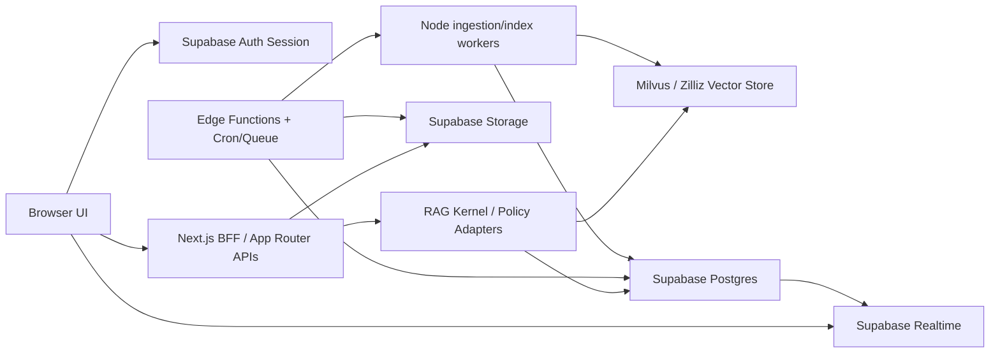
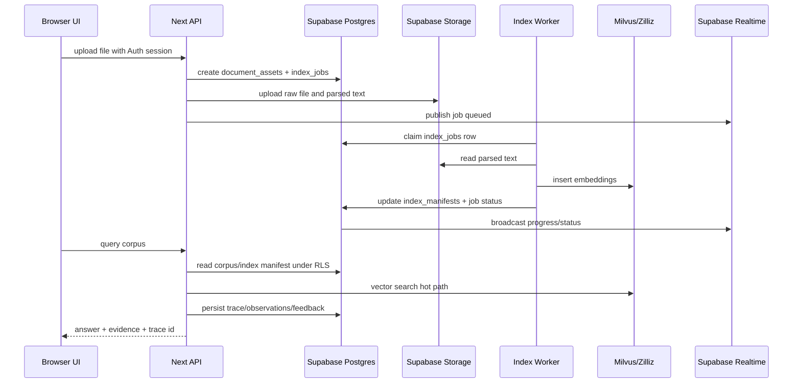

# Supabase Integration Architecture For RAG System

## Executive Summary

当前项目最值得接入 Supabase 的地方不是“再加一个数据库”，而是补齐生产级 RAG 缺失的长期状态层：

1. **身份与权限**：Supabase Auth + RLS 统一用户、租户、课程、项目、语料和 trace 的访问边界。
2. **元数据与生命周期**：Postgres 存 corpus、document、chunk、index manifest、index job、trace、feedback、MiroFish/MAIC 状态。
3. **文件与制品**：Storage 承接上传原文、解析文本、PPT、报告、缓存制品，替换本地 `uploads/` 作为生产 source of truth。
4. **实时与异步**：Realtime 发布索引进度、trace 更新、课堂/项目协作状态；Edge Functions + Cron/Queue 承接短任务编排和定时/后台任务。
5. **可选向量层**：pgvector / Supabase AI & Vectors 可作为辅助 retrieval lane，但第一阶段不替换 Milvus/Zilliz。

目标不是推翻现有 Next.js + LangChain/LangGraph + Milvus 架构，而是在它下方补一个可权限化、可审计、可恢复、可协作的云端 control plane。

## Official Capability Baseline

本方案按 2026-05-15 可查的 Supabase 官方文档对齐：

- Supabase Auth 支持常见登录方式，并与数据库 RLS 授权集成。
- Row Level Security 是浏览器可直连数据的安全前提；暴露 schema 中的表必须启用 RLS。
- Storage 与 Postgres RLS 集成，适合存文件与解析制品。
- Realtime 支持 Broadcast、Presence 和 Postgres Changes；官方建议在可扩展/安全场景优先用 Broadcast。
- Edge Functions 是 Deno/TypeScript server-side functions，适合低延迟 HTTP、webhook、轻量 AI 编排；重任务应走后台任务。
- Cron 基于 `pg_cron`，可配合 `pg_net` 调 Edge Functions。
- AI & Vectors 基于 Postgres + pgvector，可做 semantic / keyword / hybrid search。
- Automatic embeddings 官方方案使用 pgvector、pgmq、pg_net、pg_cron、Edge Functions，把 embedding 生成从同步请求中剥离。
- Storage Vectors 当前标注为 alpha，只应作为试验选项，不进入核心生产路径。

References:

- https://supabase.com/docs/guides/auth/
- https://supabase.com/docs/guides/database/postgres/row-level-security
- https://supabase.com/docs/guides/storage/security/access-control
- https://supabase.com/docs/guides/realtime
- https://supabase.com/docs/guides/realtime/subscribing-to-database-changes
- https://supabase.com/docs/guides/functions
- https://supabase.com/docs/guides/cron
- https://supabase.com/docs/guides/ai
- https://supabase.com/docs/guides/ai/vector-columns
- https://supabase.com/docs/guides/ai/automatic-embeddings
- https://supabase.com/docs/guides/storage/vector/storing-vectors

## Current Project Integration Inventory

### P0: Auth, Tenant, And Ownership

Current signals:

- `src/lib/rag/core/types.ts` already models `userId` and `sessionId` in `RagQueryRequest`.
- `src/lib/observability.ts` stores `userId` / `sessionId`, but all data is in memory.
- `src/app/page.tsx` sends demo `userId: 'demo-user'` and `sessionId: 'demo-session'`.

Supabase should own:

- `auth.users` as identity source.
- `profiles` for display/user settings.
- `tenants`, `tenant_members`, `roles`.
- RLS checks by `tenant_id` + `auth.uid()`.

Why first:

- Every later table needs ownership. Retrofitting RLS after data migration is more expensive and riskier.

### P0: Corpus, Uploads, Parsed Documents, And Index Manifests

Current signals:

- `src/app/api/upload/route.ts` writes raw files, parsed text, and `file-manifest.json` under `uploads/`.
- `src/app/api/files/route.ts` reads that manifest and falls back to directory scanning.
- `src/app/api/reasoning-rag/files/route.ts` duplicates the pattern under `reasoning-uploads/`.
- `src/lib/rag/corpus/corpus-store.ts` is an in-memory corpus/document/manifest abstraction.
- `src/app/api/milvus/sync/route.ts` syncs from local uploads into Milvus.

Supabase should own:

- Storage buckets:
  - `rag-raw-files`
  - `rag-parsed-text`
  - `maic-slides`
  - `mirofish-artifacts`
  - `reports`
- Postgres metadata:
  - corpora
  - document_assets
  - chunks
  - index_manifests
  - index_jobs

Keep local filesystem only as development fallback.

### P0: Observability, Trace, Feedback, And Evaluation

Current signals:

- `src/lib/observability.ts` stores traces, observations, and scores in `Map`.
- `src/app/api/traces/*` reads from the current in-memory RAG instance.
- Feedback route stores score through the same memory engine.

Supabase should own:

- `traces`
- `observations`
- `trace_scores`
- `retrieval_events`
- `eval_runs`
- `eval_items`

Realtime should publish trace updates to subscribed dashboards, but Postgres should remain source of truth.

### P1: Conversation History

Current signals:

- `src/lib/indexeddb.ts` stores main chat conversations in browser IndexedDB.
- `src/lib/reasoning-indexeddb.ts` stores Reasoning RAG conversations in another IndexedDB database.
- Server-side context management persists session JSON files under `data/context-sessions`.

Supabase should own:

- `conversations`
- `messages`
- `message_artifacts`
- `context_summaries`

Browser IndexedDB should remain a local cache/offline buffer, not the only copy.

### P1: MiroFish Project State

Current signals:

- `src/lib/mirofish/project-store.ts` stores projects in a singleton `Map`.
- MiroFish APIs expose projects, reports, simulation runs, interaction chat, ontology/profile generation.
- Artifact caches are file-based.

Supabase should own:

- `mirofish_projects`
- `mirofish_texts`
- `mirofish_ontology_nodes`
- `mirofish_ontology_edges`
- `mirofish_agent_profiles`
- `mirofish_simulation_runs`
- `mirofish_simulation_events`
- `mirofish_reports`

This is high value because current project state disappears on server restart.

### P1: OpenMAIC / MAIC Course And Classroom State

Current signals:

- `src/lib/maic/course-store.ts` stores courses and classroom sessions in singleton `Map`.
- `src/app/api/maic/upload/route.ts` parses slides, caches prepared artifacts, and mirrors parsed text to RAG uploads.
- `src/components/maic/OpenMaicClassroom.tsx` stores quiz answers in `localStorage`.

Supabase should own:

- `maic_courses`
- `maic_slide_pages`
- `maic_prepared_artifacts`
- `maic_classroom_sessions`
- `maic_utterances`
- `maic_quiz_answers`

Storage should hold raw PPT/PDF and normalized slide assets. Postgres should hold state and prepared artifact metadata.

### P1: Async Ingestion And Reindex Jobs

Current signals:

- Upload, parse, vectorize, and Milvus sync are mostly route-driven.
- Reasoning RAG vectorization scans upload directories.
- Long-running prepare/vectorization flows already emit progress via SSE in some routes.

Supabase should own:

- `index_jobs` with status/progress/error/retry fields.
- `job_events` for progress history.
- Cron/Queue-based retries and cleanup.
- Edge Functions for short orchestration, webhooks, and scheduled calls.

Keep heavy embedding/indexing in a Node worker or Next server job if it needs local SDKs, model runtimes, or long execution time.

### P1: Supabase Vector Lane, But Not Milvus Replacement

Current signals:

- `src/lib/milvus-client.ts` already has collection lifecycle, search params, grouping, consistency, output fields, and Zilliz/local provider support.
- Recent project direction says Milvus search policy belongs in adapter and hot paths should stay warm.

Recommended stance:

- Keep Milvus/Zilliz as primary dense-vector production lane.
- Add `SupabasePgVectorLane` for:
  - small/medium corpora
  - entity metadata embeddings
  - query/result cache embeddings
  - eval/golden dataset retrieval
  - Postgres metadata-heavy filtering
  - dev fallback when Milvus is unavailable
- Do not use Storage Vectors as core yet because official docs mark it alpha.

### P2: Realtime Collaboration And Dashboards

Worth connecting after P0/P1:

- MiroFish simulation progress and report readiness.
- MAIC classroom participants, presence, quiz answer sync, session status.
- Index job progress dashboard.
- Trace/observability live updates.

Keep LLM token streaming on existing SSE route paths unless there is a separate product reason to move it.

## Target Architecture



## Project Code Shape

Recommended new modules:

```text
src/lib/supabase/
  browser-client.ts       # publishable key, browser session only
  server-client.ts        # request-scoped server client, user JWT/RLS
  admin-client.ts         # service key, server-only, never imported by client components
  database.types.ts       # generated types
  env.ts                  # env validation

src/lib/persistence/
  ports.ts                # CorpusStore, TraceStore, BlobStore, JobStore, ConversationStore
  supabase-corpus-store.ts
  supabase-trace-store.ts
  supabase-blob-store.ts
  supabase-job-store.ts
  supabase-conversation-store.ts
  local-dev-store.ts      # current fs/Map fallback

src/lib/rag/retrieval/
  milvus-lane.ts          # wraps existing Milvus adapter
  supabase-pgvector-lane.ts
  hybrid-fusion.ts
```

Adapters should be introduced behind ports first. Existing routes then switch one by one.

## Minimum Schema Draft

The first migration should create ownership and core lifecycle tables before product-specific tables.

```sql
create table public.tenants (
  id uuid primary key default gen_random_uuid(),
  name text not null,
  created_at timestamptz not null default now()
);

create table public.profiles (
  user_id uuid primary key references auth.users(id) on delete cascade,
  display_name text,
  default_tenant_id uuid references public.tenants(id),
  created_at timestamptz not null default now(),
  updated_at timestamptz not null default now()
);

create table public.tenant_members (
  tenant_id uuid references public.tenants(id) on delete cascade,
  user_id uuid references auth.users(id) on delete cascade,
  role text not null check (role in ('owner', 'admin', 'member', 'viewer')),
  created_at timestamptz not null default now(),
  primary key (tenant_id, user_id)
);

create table public.corpora (
  id uuid primary key default gen_random_uuid(),
  tenant_id uuid not null references public.tenants(id) on delete cascade,
  name text not null,
  source_kind text not null,
  metadata jsonb not null default '{}',
  created_by uuid references auth.users(id),
  created_at timestamptz not null default now(),
  updated_at timestamptz not null default now()
);

create table public.document_assets (
  id uuid primary key default gen_random_uuid(),
  tenant_id uuid not null references public.tenants(id) on delete cascade,
  corpus_id uuid not null references public.corpora(id) on delete cascade,
  original_name text not null,
  content_type text not null,
  byte_size bigint not null default 0,
  source_hash text not null,
  storage_bucket text not null,
  storage_path text not null,
  parsed_bucket text,
  parsed_path text,
  parse_method text,
  metadata jsonb not null default '{}',
  created_by uuid references auth.users(id),
  created_at timestamptz not null default now(),
  unique (corpus_id, source_hash)
);

create table public.chunks (
  id uuid primary key default gen_random_uuid(),
  tenant_id uuid not null references public.tenants(id) on delete cascade,
  corpus_id uuid not null references public.corpora(id) on delete cascade,
  document_id uuid not null references public.document_assets(id) on delete cascade,
  chunk_index integer not null,
  content text not null,
  token_count integer,
  metadata jsonb not null default '{}',
  created_at timestamptz not null default now(),
  unique (document_id, chunk_index)
);

create table public.index_manifests (
  id uuid primary key default gen_random_uuid(),
  tenant_id uuid not null references public.tenants(id) on delete cascade,
  corpus_id uuid not null references public.corpora(id) on delete cascade,
  backend text not null check (backend in ('milvus', 'zilliz', 'supabase_pgvector')),
  collection_name text,
  embedding_model text not null,
  embedding_dimension integer not null,
  index_type text,
  metric_type text,
  version_hash text not null,
  status text not null check (status in ('pending', 'ready', 'stale', 'failed')),
  updated_at timestamptz not null default now(),
  unique (corpus_id, backend, embedding_model)
);

create table public.index_jobs (
  id uuid primary key default gen_random_uuid(),
  tenant_id uuid not null references public.tenants(id) on delete cascade,
  corpus_id uuid references public.corpora(id) on delete set null,
  document_id uuid references public.document_assets(id) on delete set null,
  job_type text not null check (job_type in ('parse', 'embed', 'milvus_sync', 'reindex', 'cleanup')),
  status text not null check (status in ('queued', 'running', 'succeeded', 'failed', 'cancelled')),
  progress integer not null default 0 check (progress >= 0 and progress <= 100),
  error text,
  metadata jsonb not null default '{}',
  created_by uuid references auth.users(id),
  created_at timestamptz not null default now(),
  started_at timestamptz,
  completed_at timestamptz
);
```

Observability:

```sql
create table public.traces (
  id uuid primary key,
  tenant_id uuid not null references public.tenants(id) on delete cascade,
  user_id uuid references auth.users(id),
  session_id text,
  name text not null,
  input jsonb,
  output jsonb,
  metadata jsonb not null default '{}',
  tags text[] not null default '{}',
  status text not null check (status in ('PENDING', 'SUCCESS', 'ERROR')),
  started_at timestamptz not null default now(),
  ended_at timestamptz
);

create table public.observations (
  id uuid primary key,
  trace_id uuid not null references public.traces(id) on delete cascade,
  parent_observation_id uuid references public.observations(id) on delete set null,
  type text not null check (type in ('GENERATION', 'SPAN', 'EVENT')),
  name text not null,
  input jsonb,
  output jsonb,
  model text,
  usage jsonb,
  metadata jsonb not null default '{}',
  level text not null default 'DEFAULT',
  status_message text,
  started_at timestamptz not null default now(),
  ended_at timestamptz
);

create table public.trace_scores (
  id uuid primary key default gen_random_uuid(),
  trace_id uuid not null references public.traces(id) on delete cascade,
  observation_id uuid references public.observations(id) on delete set null,
  name text not null,
  value jsonb not null,
  source text not null check (source in ('USER', 'AI', 'SYSTEM')),
  comment text,
  created_at timestamptz not null default now()
);
```

Optional pgvector lane:

```sql
create extension if not exists vector with schema extensions;

create table public.chunk_embeddings (
  chunk_id uuid primary key references public.chunks(id) on delete cascade,
  tenant_id uuid not null references public.tenants(id) on delete cascade,
  corpus_id uuid not null references public.corpora(id) on delete cascade,
  embedding_model text not null,
  embedding extensions.vector(1536),
  metadata jsonb not null default '{}',
  created_at timestamptz not null default now()
);

create index chunk_embeddings_hnsw_idx
  on public.chunk_embeddings
  using hnsw (embedding vector_cosine_ops);
```

Use one table per embedding dimension or migration-generated dimension-specific tables if multiple dimensions must coexist.

## RLS Policy Pattern

Every tenant-owned table should use this pattern:

```sql
alter table public.corpora enable row level security;

create policy "tenant members can read corpora"
on public.corpora
for select
to authenticated
using (
  exists (
    select 1
    from public.tenant_members tm
    where tm.tenant_id = corpora.tenant_id
      and tm.user_id = auth.uid()
  )
);

create policy "tenant editors can write corpora"
on public.corpora
for all
to authenticated
using (
  exists (
    select 1
    from public.tenant_members tm
    where tm.tenant_id = corpora.tenant_id
      and tm.user_id = auth.uid()
      and tm.role in ('owner', 'admin', 'member')
  )
)
with check (
  exists (
    select 1
    from public.tenant_members tm
    where tm.tenant_id = corpora.tenant_id
      and tm.user_id = auth.uid()
      and tm.role in ('owner', 'admin', 'member')
  )
);
```

Storage policies should reference the same tenant membership through object path conventions such as:

```text
tenant/{tenant_id}/corpus/{corpus_id}/raw/{document_id}
tenant/{tenant_id}/corpus/{corpus_id}/parsed/{document_id}.txt
```

## Request Flow: Upload To Search



## Migration Plan

### Phase 0: Contracts And No-Behavior-Change Adapters

Deliver:

- Add `src/lib/persistence/ports.ts`.
- Wrap current `MemoryCorpusStore`, file manifest, and `ObservabilityEngine` behind ports.
- Add tests proving current behavior is unchanged.

Risk: low.

Validation:

- `node --test` for adapters.
- Existing `pnpm build` remains pass.

### Phase 1: Supabase Auth + Schema + Read-Only Metadata Mirror

Deliver:

- Add Supabase env validation and clients.
- Add migrations for tenant/profile/core corpus/trace tables.
- Mirror upload metadata and traces into Supabase while keeping local filesystem and in-memory maps as primary.

Risk: medium because auth/session touches every route.

Validation:

- RLS tests with anon/authenticated/service clients.
- Route tests with missing/invalid tenant.

### Phase 2: Storage Becomes Production File Source

Deliver:

- Upload raw and parsed files to Storage.
- Keep local file mirror only in dev.
- Update `files`, `upload`, `reasoning-rag/files`, MAIC upload bridge to use `BlobStore` port.

Risk: medium.

Validation:

- Upload/list/delete tests.
- Reindex from Storage parsed text.

### Phase 3: Persistent Jobs And Realtime Progress

Deliver:

- `index_jobs`, `job_events`, Realtime job channels.
- Move parsing/vectorization/Milvus sync into job runner.
- Keep SSE for token streams; use Realtime for job/trace/presence.

Risk: medium-high because async job semantics can change UX.

Validation:

- Job idempotency tests.
- Retry/cancel tests.
- Realtime authorization tests.

### Phase 4: MiroFish And MAIC Persistent Product State

Deliver:

- Migrate MiroFish project store.
- Migrate MAIC course/session store and quiz answers.
- Store reports and prepared artifacts in Storage/Postgres.

Risk: high because these flows have product semantics and long state machines.

Validation:

- Snapshot compatibility tests.
- Course/session replay tests.
- MiroFish report regeneration tests.

### Phase 5: Optional Supabase pgvector Lane

Deliver:

- `SupabasePgVectorLane`.
- Support small/dev corpus retrieval and metadata-heavy filtering.
- Keep Milvus as default production dense lane.

Risk: medium; ranking may differ from Milvus.

Validation:

- Golden questions.
- latency/recall comparison against Milvus.
- explicit feature flag.

## Environment Contract

```text
NEXT_PUBLIC_SUPABASE_URL=
NEXT_PUBLIC_SUPABASE_PUBLISHABLE_KEY=
SUPABASE_SECRET_KEY=
SUPABASE_SERVICE_ROLE_KEY=
SUPABASE_JWT_SECRET=
SUPABASE_STORAGE_RAW_BUCKET=rag-raw-files
SUPABASE_STORAGE_PARSED_BUCKET=rag-parsed-text
SUPABASE_REALTIME_ENABLED=true
RAG_PERSISTENCE_BACKEND=local|supabase|dual-write
RAG_VECTOR_BACKEND=milvus|zilliz|supabase_pgvector|hybrid
```

Rules:

- `NEXT_PUBLIC_*` keys may be used in browser clients.
- Service role and secret keys are server-only.
- `RAG_PERSISTENCE_BACKEND=dual-write` is the migration default before cutover.
- `RAG_VECTOR_BACKEND=milvus` remains the default.

## Implementation Guardrails

- Do not import `admin-client.ts` from React components or shared client modules.
- Do not let browser write tenant-owned data without RLS.
- Do not store full document text in vector metadata; store `chunk_id`, `document_id`, `source`, small labels.
- Do not run long embeddings inside Edge Functions if they exceed edge/runtime expectations; queue and process in worker.
- Do not make Realtime the only durable record. Persist first, broadcast second.
- Do not add another top-level RAG mode branch. Route Supabase vector through the RAG Kernel retrieval lane.

## Best First Implementation Slice

The highest ROI first slice is:

1. Add Supabase clients and generated DB types.
2. Add tenants/profiles/corpora/document_assets/index_manifests/index_jobs/traces migrations.
3. Add `CorpusStore`, `BlobStore`, `TraceStore`, `JobStore` ports.
4. Implement dual-write Supabase stores.
5. Migrate `/api/upload`, `/api/files`, `/api/traces`, `/api/traces/[traceId]/feedback` to the ports.

This gives the project persistent identity, corpus metadata, trace/feedback, and file lifecycle without disturbing Milvus query speed or existing RAG behavior.
